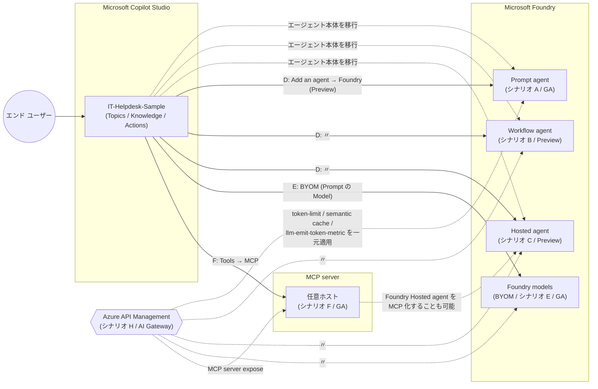

# copilot-studio-foundry-lab

> ⚠️ **作業中・検証中のドラフトです (確定版ではありません)。本番採用前に公式ドキュメントで最終確認してください。**

Microsoft Copilot Studio と Microsoft Foundry の **違い・移行・併用パターン** を、調査レポートと実行可能なデモ素材の両面から学習するためのラボ リポジトリです。

> **位置付け**: 公式ドキュメントに基づく調査結果 (`research/`) と、**7 つの移行 / 連携 / 運用シナリオ** (A〜F + H) に対応する再現用素材 (`demo-assets/`)、横断的なガバナンス / FinOps の補助ドキュメント (`docs/`) をセットで提供します。プロダクション用テンプレートではなく、**社内勉強会・PoC・お客様デモの出発点**として利用してください。

## ディレクトリ構成

```
.
├── README.md          ← このファイル
├── CODE_OF_CONDUCT.md ← Microsoft Open Source Code of Conduct
├── CONTRIBUTING.md    ← コントリビュート ガイド
├── LICENSE            ← MIT ライセンス
├── SECURITY.md        ← 脆弱性報告手順 (MSRC)
├── .gitignore
├── demo-assets/       ← 7 シナリオ (A〜F + H) の再現素材一式 (手順書・サンプル コード・OpenAPI など)
├── docs/              ← 横断ドキュメント (Governance / FinOps)
└── research/          ← Microsoft Copilot Studio vs Microsoft Foundry の調査レポート (出典付き)
```

| ディレクトリ | 役割 | まず読むファイル |
|---|---|---|
| [`research/`](research/) | Microsoft Copilot Studio と Microsoft Foundry の機能差・移行可否・連携パターンの調査結果 | [`copilot-studio-foundry-final-report.md`](research/copilot-studio-foundry-final-report.md) |
| [`demo-assets/`](demo-assets/) | 7 シナリオ (A〜F + H) の手順書・コード・設定サンプル | [`README.md`](demo-assets/README.md) / [`00-create-cs-agent.md`](demo-assets/00-create-cs-agent.md) |
| [`docs/`](docs/) | シナリオ横断の補助ドキュメント (Governance / FinOps) | [`governance.md`](docs/governance.md) / [`cost-finops.md`](docs/cost-finops.md) |

## アーキテクチャ全体図

シナリオ A〜F (移行 / 連携の中核) を中心に、H (APIM AI Gateway) が **上位レイヤー** として被さる関係を示しています。



## 取り扱うシナリオ (demo-assets)

シナリオは **3 つのレイヤー** に整理しています。シナリオ A〜D / F は共通の出発点として **Microsoft Copilot Studio に同一の `IT-Helpdesk-Sample` エージェントを構築**します (シナリオ E は既存の Microsoft Copilot Studio エージェントを前提に開始)。

| シナリオ | レイヤー | Microsoft Foundry 側の受け皿 / 利用形態 | 状態 |
|---|---|---|---|
| **A** | エージェント本体 (移行) | Prompt agent | GA |
| **B** | エージェント本体 (移行) | Workflow agent | Preview |
| **C** | エージェント本体 (移行) | Hosted agent | Preview |
| **D** | エージェント間連携 | Microsoft Copilot Studio + Microsoft Foundry agent 接続 | Preview |
| **E** | モデル / ツール単位 | Microsoft Copilot Studio + Microsoft Foundry モデル (BYOM) | GA |
| **F** | モデル / ツール単位 | Microsoft Copilot Studio + MCP server (Microsoft Foundry 含む) | GA |
| **H** | ガバナンス / FinOps | Azure API Management を AI Gateway として被せる | APIM コア GA / Foundry 統合 Preview |

詳細・前提条件・各シナリオの完全手順・選定フローチャート (12 列の比較表) は [`demo-assets/README.md`](demo-assets/README.md) を参照してください。

## 使い方の流れ

1. [`research/copilot-studio-foundry-final-report.md`](research/copilot-studio-foundry-final-report.md) で両プロダクトの違いと「移行 vs 連携」の判断軸を把握する。
2. [`demo-assets/README.md`](demo-assets/README.md) で 7 シナリオ (A〜F + H) の概要と選定フローチャートを確認し、目的に合うシナリオを選ぶ。
3. [`demo-assets/00-create-cs-agent.md`](demo-assets/00-create-cs-agent.md) に従って Microsoft Copilot Studio 側を構築する (シナリオ A〜D / F 共通。E は既存エージェントを前提)。
4. 選んだシナリオの README に沿って Microsoft Foundry 側 (またはモデル / MCP server) を構築・接続する。
5. (本番化を見据える場合) [`docs/governance.md`](docs/governance.md) / [`docs/cost-finops.md`](docs/cost-finops.md) を参照し、ガバナンス / 課金の設計を上乗せする。

> 💡 **段階的移行の推奨パス**: いきなり A〜C で全面移行するのではなく、まず **E (モデル品質を 1 Prompt で検証)** → **D (1 機能だけ agent 委譲で検証)** → 必要に応じ **A/B/C で全面移行** → 本番運用に向けて **H (ガバナンス・FinOps)** を被せる、という順で進めると低リスクです。F は D / E と並行して進められます。

## 前提・想定読者

- Microsoft Copilot Studio / Microsoft Foundry いずれかに触れた経験がある開発者・アーキテクト
- 移行や連携の判断材料、または社内デモのシナリオを探している方
- 本番リリース前に **ガバナンス / FinOps** の設計を上乗せしたいプラットフォーム エンジニア / FinOps 担当
- 必要なライセンス・RBAC・SDK バージョンは各シナリオ README に記載

## 注意事項

- 本リポジトリ内の説明・コードは **公開ドキュメントに基づく学習・検証用** です。Preview / Early Access Preview 機能の仕様は変更される可能性があるため、最終判断は必ず最新の公式ドキュメントで確認してください。
- `research/` のレポートは出典 (脚注) 付きで記述しています。差分や疑義があれば該当出典を参照してください。
- 自然言語の説明・手順は日本語、コード / 識別子 / 公式名称は原文のままです。
- 価格情報 (`docs/cost-finops.md`) は 2026 年 5 月時点の list price ベース。EA / MCA / CSP 等の契約割引は別途反映してください。
