# 00. 共通: Microsoft Copilot Studio で IT ヘルプデスク エージェントを作成する

> 本書はシナリオ A〜D / F の **共通の出発点** です。各シナリオ README から `..\00-create-cs-agent.md` として参照されます (シナリオ E は既存の Microsoft Copilot Studio エージェントが前提)。
> シナリオ A〜D / F はいずれも、ここで作る同一の Microsoft Copilot Studio エージェント (**IT-Helpdesk-Sample**) を出発点に、Microsoft Foundry 側の受け皿 (A〜D) や、モデル / MCP server の接続先 (E / F) を変えていく構成です。

---

## 0. このフェーズで作るもの

| 要素 | 内容 |
|---|---|
| エージェント名 | `IT-Helpdesk-Sample` |
| 説明 | Contoso 社内 IT ヘルプデスク。社内 IT 利用規定を引用し、必要時のみチケットを起票 |
| 言語 | 日本語 |
| 生成 AI | **ON** (既定) |
| ナレッジ | `it-policy.md` (本リポジトリ `common/sample-knowledge/`) を File upload で登録 |
| トピック | `PasswordReset` — Question + Power Fx 条件で社内 PC / 社外 PC 分岐 |
| Action | `CreateTicket` — HTTP Request ノードでチケット起票エンドポイントを呼び出し |

最後に **`pac copilot extract-template`** で YAML テンプレートをエクスポートし、シナリオ A〜D のいずれかの Microsoft Foundry 受け皿に渡します (シナリオ E / F では YAML 抽出は必須ではありませんが、構成変更時の差分管理用に取得しておくと便利です)。

---

## 1. 前提条件

### 1.1 ライセンス

MS Learn 該当箇所: [Copilot Studio にアクセスする](https://learn.microsoft.com/ja-jp/microsoft-copilot-studio/requirements-licensing-subscriptions)

主なライセンスの種類:

- **Copilot Studio (Standalone)** — 全機能利用可
- **Copilot Studio for Teams plan** (一部 Microsoft 365 サブスクリプションに同梱) — 機能制限あり
- **Trial** (30 日、サインアップ: <https://go.microsoft.com/fwlink/?LinkId=2107702>) — デモ・検証用

> 各ライセンスの適用範囲・価格・割り当て方法などの詳細は割愛します。導入検討時は **担当営業 / Microsoft パートナー** にご相談ください。デモ目的であれば Trial で十分です。

### 1.2 環境 (Power Platform Environment)

MS Learn 該当箇所: [Power Platform 環境に関する作業](https://learn.microsoft.com/ja-jp/microsoft-copilot-studio/environments-first-run-experience)

- 初回サインインで既定環境が自動作成されますが、**本番想定のデモなら別途 Production 環境を作るのが推奨**
- 作成場所: <https://admin.powerplatform.com> → Environments → New
  - Region (データ存在地域)、Type = **Production**、Dataverse = **Yes** を必ず指定
- **注意:** Power Platform admin center に表示される「Microsoft 365 Copilot Chat」環境は M365 Copilot の課金管理用です。**Copilot Studio エージェントの構築には使わないこと**

### 1.3 Maker 権限

- 最低限: 環境内で **agent author** セキュリティロール
- 後段のソリューション エクスポートに **System Customizer** ロールも必要

---

## 2. Phase 1 — Copilot Studio ポータルでエージェントを新規作成

MS Learn 該当箇所: [エージェントの作成と削除](https://learn.microsoft.com/ja-jp/microsoft-copilot-studio/authoring-first-bot)

### 2.1 サインインと環境選択

1. **<https://copilotstudio.microsoft.com>** にサインイン
2. 画面上部の **環境セレクター** で対象環境を選択 (作成後に変更不可ではないが、別環境で作ったエージェントは別物として扱われる)

### 2.2 エージェント作成 (Blank パスを推奨)

デモ再現性確保のため、AI 自動生成 (Describe) ではなく **Blank** から始めます。

#### 2.2.1 ホーム画面の構成と 2 つの作成パス

ホーム画面の「**何を構築しますか?**」見出しの下には、エージェント作成に使う UI が 2 系統あります。

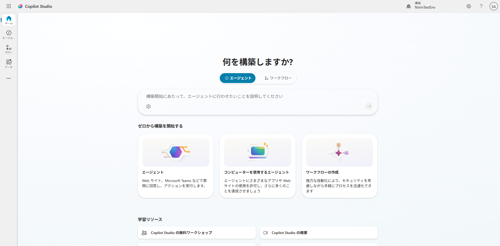

| パス | UI | 内容 | 本デモでの扱い |
|---|---|---|---|
| **A. Describe (AI 自動生成)** | 上段のテキスト ボックス「構築開始にあたって、エージェントに行わせたいことを説明してください」 → **Send (→)** | 入力した説明文から AI が Name / Description / Instructions / 初期 Topic を自動生成。テキスト ボックス左下の **⚙ 詳細設定ボタン** で言語 / ソリューション / スキーマ名を事前設定可能 | **使わない** (出力が毎回ブレるため共通シナリオの出発点には不向き) |
| **B. Blank (空からスタート)** | 下段「**ゼロから構築を開始する**」セクションの **エージェント** カード | 名前と最低限の設定だけ指定して空のエージェントを作成。Name / Description / Instructions は手動で固定値を入れられる | **本デモで使用** |


#### 2.2.2 Blank パスでエージェントを作成

1. 「ゼロから構築を開始する」セクションの **エージェント** カードをクリック
2. ポップアップ **「エージェント に名前をつける」** が開きます

   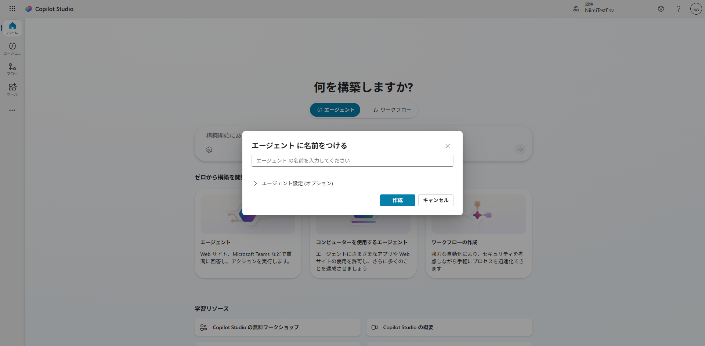

3. **エージェント の名前を入力してください** に名前を入力 (本デモでは `IT-Helpdesk-Sample`)
4. **▼ エージェント設定 (オプション)** を展開して以下を確認・設定 (各項目の右にある **ⓘ アイコン** にカーソルを合わせると公式ツールチップが表示されます):

   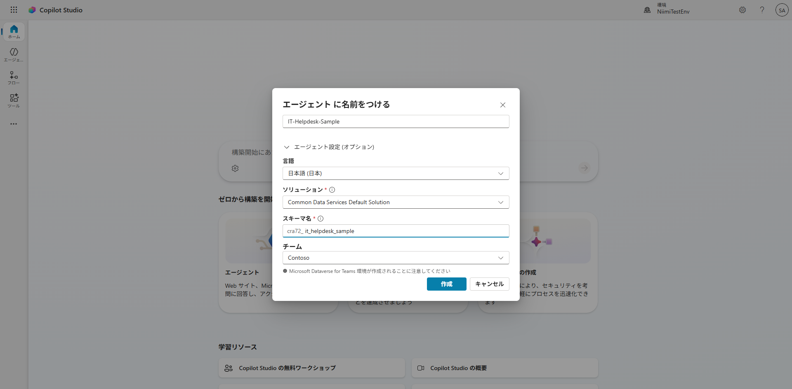

   | フィールド | 必須 | 既定値 | 本デモでの設定 | 補足 |
   |---|---|---|---|---|
   | **言語** | — | `日本語 (日本)` | そのまま |  |
   | **ソリューション** \* | ✅ | `Common Data Services Default Solution` | そのまま (または任意の Custom Unmanaged ソリューション) | 後で `pac` 抽出する場合は専用ソリューションに入れておくと管理しやすい |
   | **スキーマ名** \* | ✅ | `<env_prefix>_gent_XXXXX` (例 `cra72_gent_Z36vX`) | 接尾辞部分を `it_helpdesk_sample` に書き換え (プレフィックス `cra72_` 等はソリューション固有で固定) | UI 上は **プレフィックス枠 + 編集可能な接尾辞枠** の 2 分割表示 |
   | **チーム** | — | `Contoso` 等の Microsoft Teams 名 |  チームを選択 |  |

   > 📘 **ソリューションとは**: ユーザー / エージェントが作成したコンテンツを格納する **Power Apps (Dataverse) 内のフォルダー** に相当します。エージェント・Topic・Flow・カスタム コネクタなどをひとまとめにして、別環境への Export / Import (移行) を行う単位になります。
   >
   > 📘 **スキーマ名とは**: ソリューション内でエージェントのコンテンツを詳細に管理するための**機械可読な識別子**です。エージェントの**表示名 (Display Name) には依存しません**。表示名は後から変更できますが、スキーマ名は作成時に確定するため、命名規則 (小文字 + アンダースコア) を意識して付けてください。

5. **作成** (右下の青いボタン) をクリック → 空のエージェントがプロビジョニングされ、**概要ページ**に遷移します

### 2.3 概要ページの構成

エージェント作成後、まず表示されるのが **概要ページ** です。ここはエージェント本体の編集ハブで、フォーム 1 枚ではなく**複数のカード (widget)** が縦に並んでおり、それぞれ独立した **編集** ボタン (✏ 鉛筆アイコン) で編集します。

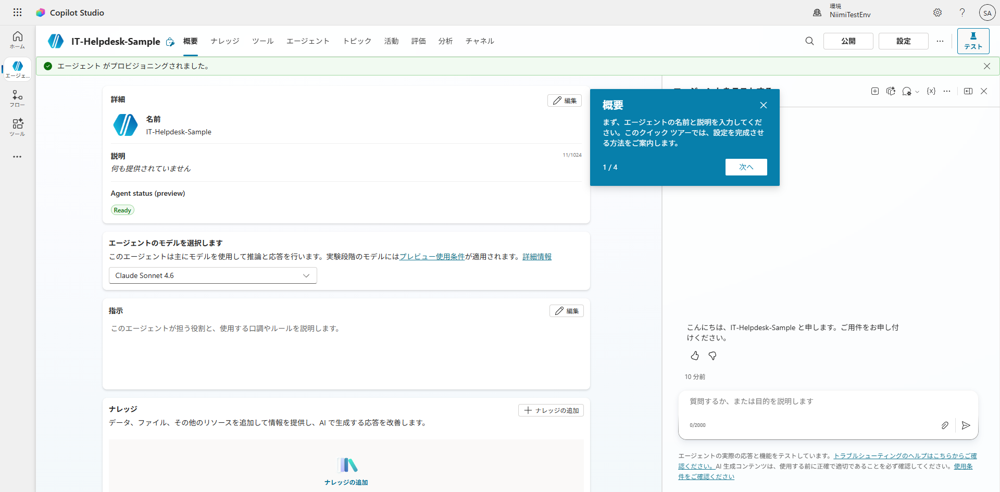

### 2.4 指示を入力する

MS Learn 該当箇所: [エージェントの作成と削除](https://learn.microsoft.com/ja-jp/microsoft-copilot-studio/authoring-first-bot)

1. **指示** カードの右上 **✏ 編集** をクリック (textbox がフォーカスされる)
2. 既定のプレースホルダー「このエージェントが担う役割と、使用する口調やルールを説明します。」を消して、以下を貼り付け:

```
あなたは Contoso 株式会社の社内 IT ヘルプデスク アシスタントです。

# 基本ルール
- ナレッジ (社内 IT 利用規定) を根拠に [filename] 付きで回答する
- パスワード / MFA コード / PIN 等の秘密情報をユーザーに尋ねない
- 緊急インシデント (情報漏えい・進行中の攻撃) は CSIRT ホットライン (内線 119) を案内する
- 解決しない場合のみ CreateTicket を呼び出してチケットを起票する (ユーザー同意必須)
```

3. 保存する


### 2.5 生成 AI 設定の確認 (設定 → 生成 AI)

新規作成エージェントは **既定で生成 AI オーケストレーション ON** ですが、設定パネルから明示的に確認しておきます。

#### 手順

1. 概要ページ右上の **設定** ボタンをクリック
2. **設定** パネルが開き、左ナビの **生成 AI** が既定で選択された状態で `/manage/advancedSettings` ページが表示される
3. 右ペイン最上部の **オーケストレーション** セクションで、以下のラジオ ボタンが選択されていることを確認:
   - ✅ **はい、利用できるツールやナレッジを適宜使用し、応答を動的にします。** ← 本デモはこれ (既定)
   - ◯ いいえ、クラシック オーケストレーションを使用します。エージェントのトピックで定義されたコンテンツと動作への応答が制限されます。
4. 変更した場合のみ、画面下部の **保存** ボタンをクリック

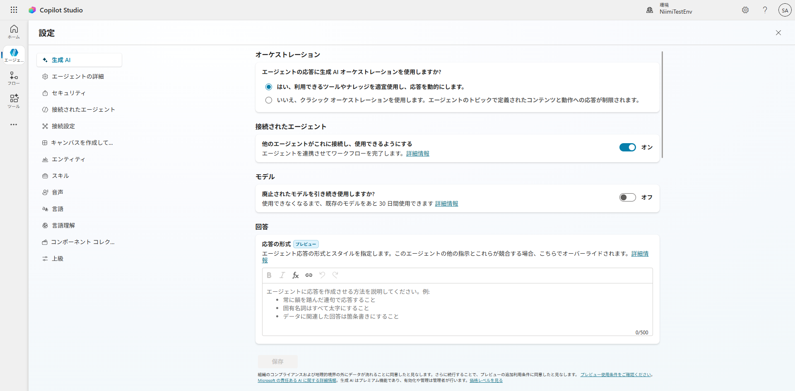

#### この設定の意味

| ラジオ選択 | 動作 | 本デモでの扱い |
|---|---|---|
| **はい** (生成 AI オーケストレーション) | LLM が **Topic の Description / Tool の説明 / Knowledge** をもとに動的にルーティング | ✅ 既定。`PasswordReset` Topic の Description で確定的フローへ誘導 |
| **いいえ** (クラシック オーケストレーション) | **Topic の trigger phrase** に完全一致したときのみ Topic 起動 | Foundry に移行できないレガシー挙動。本デモでは使わない |


---

## 3. Phase 2 — ナレッジ ソースを追加 (it-policy.md)

MS Learn 該当箇所 (概要): [既存のエージェントにナレッジを追加する](https://learn.microsoft.com/ja-jp/microsoft-copilot-studio/knowledge-add-existing-copilot)
MS Learn 該当箇所 (ファイル アップロード): [ナレッジ ソースとしてファイルをアップロードする](https://learn.microsoft.com/ja-jp/microsoft-copilot-studio/knowledge-add-file-upload)

### 3.1 サポート形式と上限

| 項目 | 値 |
|---|---|
| 最大ファイル サイズ | 512 MB / 1 ファイル |
| 最大ファイル数 | 500 / 1 エージェント |
| 主要対応形式 | `.md` / `.txt` / `.pdf` / `.docx` / `.pptx` / `.xlsx` / `.html` / `.csv` / `.json` / `.yaml` 他 |
| 非対応 | 暗号化/機密ラベル付きファイル、画像・動画・実行可能ファイル |
| **前提** | 環境で **Dataverse 検索** が有効化されていること (確認場所は下記) |

> 🔍 **Dataverse 検索 の確認/有効化場所**
>
> 1. [Power Platform 管理センター](https://admin.powerplatform.microsoft.com/) を開く
> 2. 左ナビ **環境** → 対象環境 (本デモは `NiimiTestEnv`) をクリック
> 3. 上部コマンド バー **設定** をクリック → 設定ページに遷移
> 4. 左カテゴリ **製品** グループを展開 → **機能** を開く (URL 直リンク例: `/manage/environments/<envId>/settings/Features`)
> 5. 右ペインを下にスクロールして **「Dataverse 検索」** セクションを探す
> 6. 以下 2 つのチェックボックスを確認:
>    - ✅ **検索インデックスをオンにして、AI とエージェントのエクスペリエンス内で Dataverse インテリジェンス (Work IQ) をサポートする** ← Copilot Studio のファイル ナレッジに必須
>    - ☐ グローバル検索バーをすべてのモデルドリブン アプリ内に表示し、検索インデックス作成をオンにして、検索専用エクスペリエンスをサポートする (任意)
> 7. 変更した場合のみ右下 **保存** をクリック
>
> 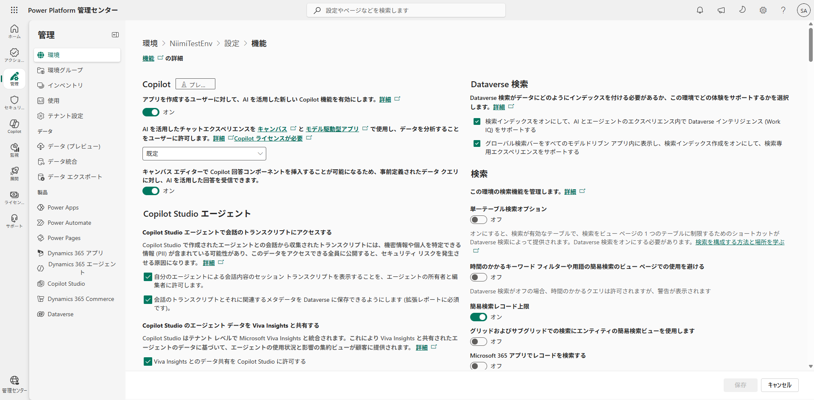
>
> ⚠️ **権限**: 確認のみメーカー権限で可、**有効化/変更には Power Platform 管理者 (または System Administrator) ロール**が必要です。一般ユーザーは admin に依頼してください。

### 3.2 it-policy.md を登録する手順

1. 概要 **ナレッジ** → **＋ナレッジの追加**
2. `demo-assets\common\sample-knowledge\it-policy.md` をドラッグ&ドロップ

   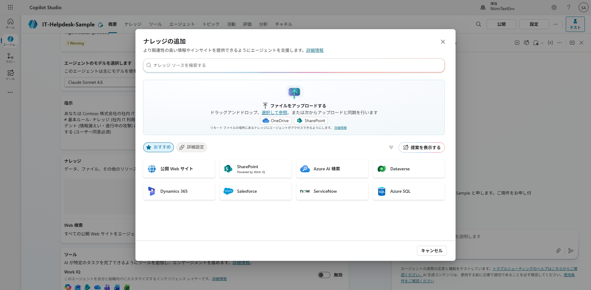
3. **エージェントに追加する**
4. ステータスが **準備完了** になるまで待機

   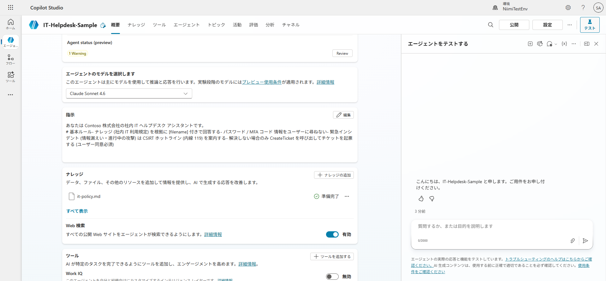

---

## 4. Phase 3 — Topic を作成 (パスワードリセット)

MS Learn 該当箇所 (トピックの作成): [トピックの作成と編集](https://learn.microsoft.com/ja-jp/microsoft-copilot-studio/authoring-create-edit-topics)
MS Learn 該当箇所 (質問ノード): [質問する](https://learn.microsoft.com/ja-jp/microsoft-copilot-studio/authoring-ask-a-question)
MS Learn 該当箇所 (条件 + Power Fx): [トピックに条件を追加する](https://learn.microsoft.com/ja-jp/microsoft-copilot-studio/authoring-using-conditions)
MS Learn 該当箇所 (トリガー フレーズ): [効果的なトリガーフレーズを設計しましょう](https://learn.microsoft.com/ja-jp/microsoft-copilot-studio/guidance/trigger-phrases-best-practices)

### 4.1 トピック 新規作成

1. エージェント編集ページ上部のタブから **トピック** タブをクリック
2. ツールバー左の **＋ トピックの追加** ボタン (▾ ドロップダウン) を開き、**最初から** を選択

   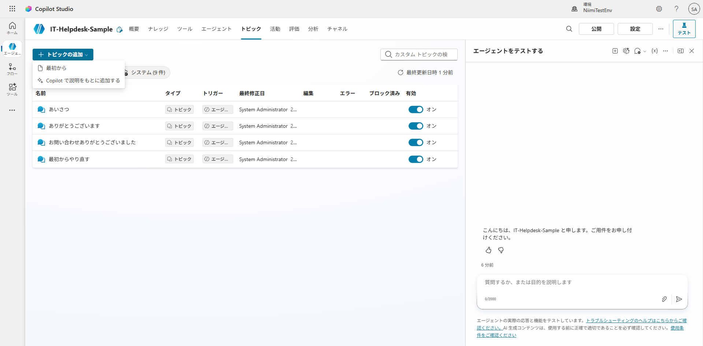
3. トピック エディター (作成キャンバス) が開く (トリガー ノードのみが配置された状態)
4. 左上のパンくず内の見出し **無題** (トピック名テキストボックス) をクリックし、`パスワードリセット` に変更
5. トリガー ノード内の **トピックの機能を説明する** テキストボックス (placeholder 例: 「このトピックでは、サポート チケットに関する情報…」) に、生成 AI 向けの説明文を入力:

   `ユーザーが社内システムのパスワードを忘れた、またはアカウントがロックアウトされたときに使用する。社内 PC / 社外 PC で案内先が異なる手順を提供する。`

   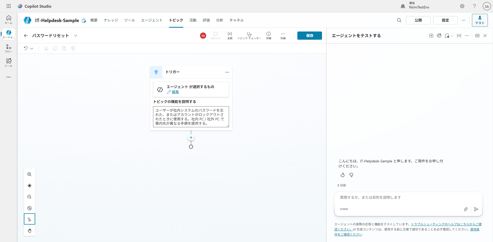
6. (任意) トリガー ノード内 **エージェント が選択するもの** の **編集** リンクから、生成 AI がこのトピックを呼び出す判断条件を上書きできる (通常は既定のままで OK)

### 4.2 トリガー — 生成 AI オーケストレーション モードでのフレーズ指定


#### 推奨フォーマット (説明文の末尾に追記)

1. トリガー ノードの **トピックの機能を説明する** テキストボックスをクリック (展開されてマルチライン入力可能になる)
2. 4.1 で入力した役割の説明のあと、**改行 2 回** (空行 1 行を挟む) してから以下を追記:

   ```
   このツールは次のようなクエリを処理できます: パスワードを忘れた, パスワードがわからない, ロックアウト, ログインできない, パスワードリセット, アカウントがロックされた, パスワードを変更したい
   ```

3. キャンバス右上の **保存** ボタンをクリック (保存後はボタンがグレーアウト)

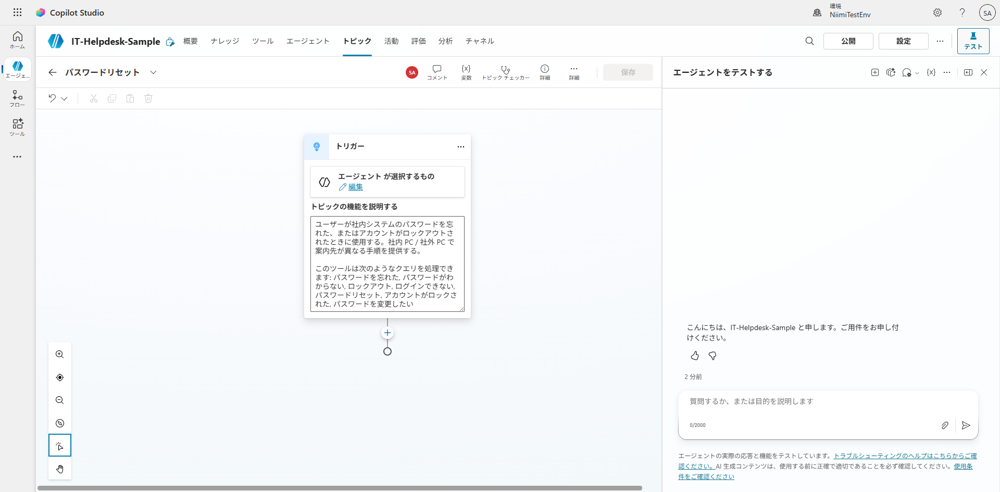

#### ベスト プラクティス

- **5〜10 件以上**、語順や用語のバリエーションを変える
- 1 フレーズあたり **10 単語以内**、単語 1 つだけのフレーズは避ける
- 最大 200 フレーズ / トピック

詳細は MS Learn 該当箇所: [効果的なトリガーフレーズを設計しましょう](https://learn.microsoft.com/ja-jp/microsoft-copilot-studio/guidance/trigger-phrases-best-practices) を参照。

### 4.3 質問する ノード — 社内 PC か 社外 PC か

1. トリガー ノード下の **＋ (ノードの追加)** をクリックし、メニューから **質問する** を選択

   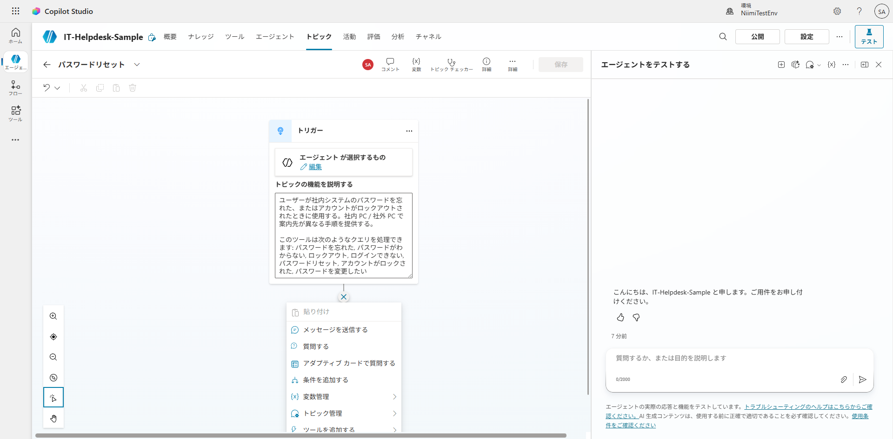

2. 追加された質問ノードの **メッセージを入力する** テキストボックス (placeholder は「メッセージを入力する」ですが内部の textbox 名は「メッセージのバリエーション」) に以下を入力:

   ```
   お使いの PC は社内 PC ですか、社外 PC ですか？
   ```

3. ノード下部 **特定** セクションの種別ドロップダウンが **複数選択式オプション** になっていることを確認 (既定で選択済み)
4. **ユーザーのオプション** 配下の **＋ 新しいオプション** ボタンをクリック → 入力欄に `社内PC` と入力 → Enter で確定
5. 再度 **＋ 新しいオプション** をクリック → `社外PC` と入力 → Enter で確定

   > 💡 **自動分岐の生成**: オプションを確定するたびに、ノードの直下に `Topic.<変数> が <オプション値> と等しい` という **条件** ブランチが自動的に追加されます。最後のブランチとして **その他のすべての条件** も自動付与されます。手動で「条件を追加する」ノードを置く必要はありません。

6. **ユーザーの応答を名前を付けて保存** セクションの変数名ボタン (既定で `Var1:choice`) をクリックし、右側に開くプロパティ パネルの **変数名** テキストボックスを `PCType` に書き換えて Tab キーでフォーカスを外す (型は自動的に **choice**、3 箇所すべての参照が一括で更新される)
7. プロパティ パネルを **×** で閉じる

完成時のキャンバスは下図のようになります (左下のズーム ボタンで 1 段階縮小し、テスト ペインを閉じた状態)。

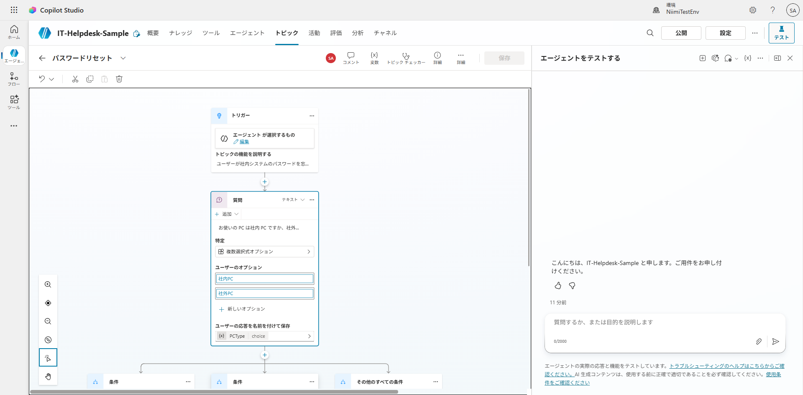

### 4.4 各分岐に メッセージを送信する ノードを追加

4.3 で自動生成された 3 つのブランチに、案内メッセージを返すノードをそれぞれ追加します。

| ブランチ | 用途 | 追加するノード |
|---|---|---|
| `条件: Topic.PCType が 社内PC と等しい` | 社内 PC 案内 | メッセージを送信する |
| `条件: Topic.PCType が 社外PC と等しい` | 社外 PC 案内 | メッセージを送信する |
| `その他のすべての条件` | 想定外応答時のフォールバック | メッセージを送信する |

**手順 (各ブランチ共通):** ブランチ下の **＋ (ノードの追加)** をクリック → メニューから **メッセージを送信する** を選択 → メッセージ本文を入力。

**社内PC ブランチ:**

```
社内 PC をお使いの場合は、セルフサービス リセット ポータル
https://passwordreset.contoso.local
から再設定してください。アカウントは 5 回失敗で 30 分間ロックされます。
```

**社外PC ブランチ:**

```
社外 PC の場合は IT ヘルプデスク (内線 8888 / helpdesk@contoso.com)
にご連絡ください。
```

**その他のすべての条件 ブランチ:**

```
すみません、社内 PC か社外 PC かを判別できませんでした。もう一度お選びください。
```

完成後、キャンバスを 1〜2 段階縮小すると、質問ノード + 3 条件ブランチ + 3 メッセージ ノードがフローとして俯瞰できます。

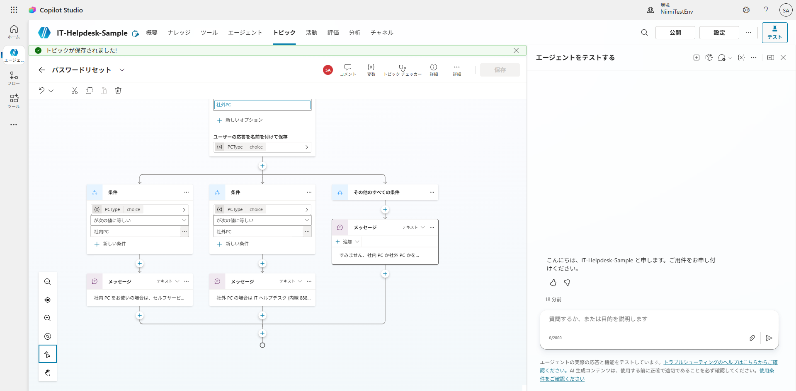

> ℹ️ **Power Fx で条件式を直接編集したい場合**: 各ブランチの値入力欄 (例: `社内PC` が入っている combobox) の右側にある **...** アイコン (「変数の選択」ボタン) をクリックすると **変数を選択する** モーダル ダイアログが開きます。ダイアログ上部の **計算式** タブを選択し、フォーミュラ バーに `"社内PC"` のような Power Fx 式を入力 → **挿入** で確定できます。文字列リテラルは必ずダブルクォート (`"..."`) で囲む必要があります (素の `社内PC` のままだと `名前が無効です` エラーになります)。MS Learn 該当箇所: [変数で Power Fx 式を使用する](https://learn.microsoft.com/en-us/microsoft-copilot-studio/authoring-variables-power-fx)
>

### 4.5 Power Fx 変数スコープ参考

トピック上部メニューバーの **{x} 変数** ボタンをクリックすると、画面右側に **変数** パネル (参照タブ) が開き、現在のトピックから参照できる変数がスコープ別にグループ化されて表示されます。

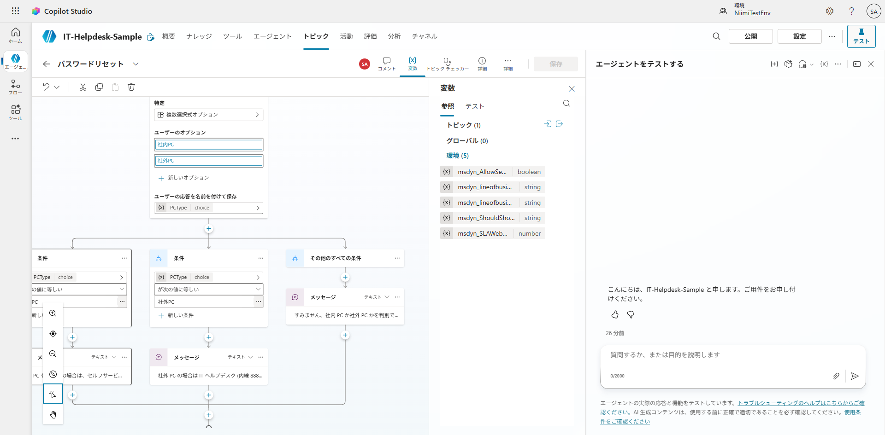

| Power Fx プレフィックス | 変数パネルでの表示 | 変数を選択するダイアログでの表示 | 例 | 補足 |
|---|---|---|---|---|
| `Topic.` | **トピック** グループ | **カスタム** タブ | `Topic.PCType` | 同一トピック内のみ有効。質問ノード等で自動生成される |
| `Global.` | **グローバル** グループ | **カスタム** タブ (グローバル変数のセクション) | `Global.UserName` | 全トピックで共有。トピック変数を昇格 (**変数のプロパティ** から **グローバル変数に変換**) して作成 |
| `System.` | (変数パネルには非表示) | **システム** タブ | `System.Conversation.Id` | 組み込み変数。会話 ID / ユーザー情報 / アクティビティなど |
| `Environment.` | **環境** グループ | **環境** タブ | `Environment.msdyn_AllowSelectLeafOnly` | Power Platform の環境変数。Azure Key Vault のシークレットも参照可 |

> ℹ️ **変数パネルとダイアログでタブ名が違う**: 変数パネル (`{x} 変数` 経由) では **トピック / グローバル / 環境** の 3 グループに分かれ、変数を選択するダイアログ (値入力欄の `>` ボタン経由) では **カスタム / システム / 環境 / 計算式** の 4 タブに分かれます。同じ変数でも UI 上の表記が異なる点に注意してください。MS Learn 該当箇所: [変数の作成と管理](https://learn.microsoft.com/ja-jp/microsoft-copilot-studio/authoring-variables)

> ⚠️ **Foundry の Workflow agent は `Topic.*` / `Global.*` 非対応。** すべて `Local.*` に書き換える必要があります (シナリオ B の README で詳述)。

### 4.6 保存

キャンバス右上のツールバーの **保存** ボタンをクリック (トピック単位で保存)。ボタンは未変更時はグレーアウト、編集があるとアクティブ化されます。保存が成功すると画面上部に「**トピックが保存されました!**」のトースト通知が表示され、保存ボタンが再度グレーアウトに戻ります。

---

## 5. Phase 4 — Action を追加 (CreateTicket HTTP 要求)

MS Learn 該当箇所: [HTTP 要求を行う](https://learn.microsoft.com/ja-jp/microsoft-copilot-studio/authoring-http-node)

`demo-assets\common\tools\create-ticket.openapi.yaml` の OpenAPI 仕様を参考に、Copilot Studio では **HTTP 要求の送信 ノード** で同等処理を構築します。

> 📌 **必須範囲**: ハンズオンとしての必須は **5.1 (HTTP 要求の送信 ノードを 1 つ作成して保存)** までです。**5.2** (エラー ハンドリング) と **5.3** (Power Automate フロー版) は本番運用や既存資産がある場合の任意/代替手段です。

### 5.1 HTTP 要求の送信 ノードを追加

パスワードリセット トピック内の **社外 PC ブランチ** (チケット起票が必要な分岐) の メッセージ ノード直下で:

1. **＋ (ノードの追加)** をクリックし、メニュー最下部の **詳細** を **クリック** (ホバーではなくクリックで展開) → サブメニューを開く

   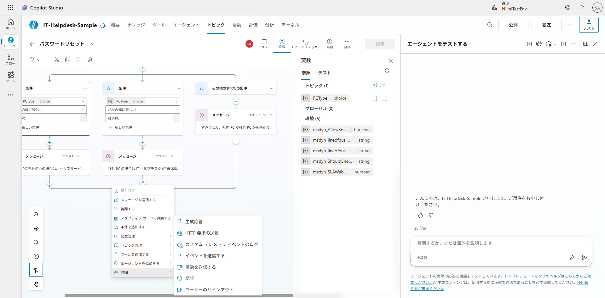

   サブメニューの内容 (上から):
   - 生成応答
   - **HTTP 要求の送信** ← これを選択
   - カスタム テレメトリ イベントのログ
   - イベントを送信する
   - 活動を送信する
   - 認証
   - ユーザーのサインアウト

2. ノードが追加されると、既定の名前は **「フォールバック: HTTP 要求」** (接頭辞が自動付与) となります。必要に応じてノード名を変更します。
3. **URL** *: `https://httpbin.org/post` (デモ用エンドポイント)
4. **メソッド** (既定は `Get`): combobox を開いて `Post` を選択 (選択肢は Get / Post / Patch / Put / Delete)
5. **ヘッダーと本文** の **編集** ボタンをクリック → サブパネルが展開
6. **ヘッダー** で **追加** をクリックし、キーと値を入力:
   - **キー**: `Content-Type`
   - **値**: `application/json`
7. **本文** combobox (既定 `コンテンツなし`) で **JSON コンテンツ** を選択。下に表示されるコード エディター (Monaco) に Power Fx レコード記法で入力 (※ JSON コンテンツ モードでは Power Fx 式として評価されるため、プロパティ名はクォート不要):

   ```json
   { summary: "パスワードリセットの相談", priority: "medium", category: "account", user_consent: true }
   ```


8. **応答のデータ タイプ** combobox (既定 `種類の選択`) を開き、**サンプル データから** を選択 (他の選択肢: `String` / `Boolean` / `Number` / `Record` / `Table` / `Any`)
9. 隣に現れる **サンプル JSON からスキーマを取得する** ボタンをクリック → ダイアログが開く
10. ダイアログのエディターに以下を貼り付けて **確認** をクリック (スキーマが自動推論され、戻ると **スキーマを編集する** ボタンに切り替わります):

    ```json
    { "ticket_id": "TK-1234", "status": "created" }
    ```

11. **応答を名前を付けて保存** の **変数を選択する** ボタンをクリック → 変数選択ダイアログで **新しい変数を作成する** をクリック (既定では `Var1:record` が生成されます)
12. 生成された変数ボタン (`Var1:record`) をクリックすると右側に **変数 のプロパティ** パネルが開きます。**変数名** を `Var1` から `TicketResponse` に変更 → プロパティ パネルを閉じる

    変数ボタンの表示は `TicketResponse:record` となります (Power Fx での参照は `Topic.TicketResponse`)。

    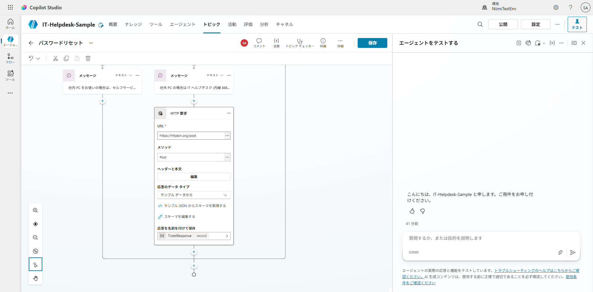

13. 後続ノードで `Topic.TicketResponse.ticket_id` のように参照できます。

### 5.2 エラー ハンドリング (オプション)

エラー時の動作は、HTTP 要求ノードのプロパティ パネル → **ヘッダーと本文** の **編集** をクリックして開くサブパネル内、**エラー処理** ドロップダウンで設定します。

1. 5.1 で作成した **フォールバック: HTTP 要求** ノードを再度クリックしてプロパティ パネルを開く
2. **ヘッダーと本文** セクション右側の **編集** ボタンをクリック → サブパネルが展開
3. **エラー処理** ドロップダウンを開き、以下の 2 択から選択:

   | 選択肢 | 動作 | 追加で必要な設定 |
   | --- | --- | --- |
   | **エラーを発生させる** (既定) | HTTP 呼び出しが失敗 (4xx/5xx/タイムアウト等) するとシステムの `On Error` トピックが発火 | なし |
   | **エラーでも続行** | エラーレスポンスを変数に格納してトピック内で復旧処理を継続 | **エラー応答の本文** (変数を選択する) で Body 受け取り用変数を指定 |

   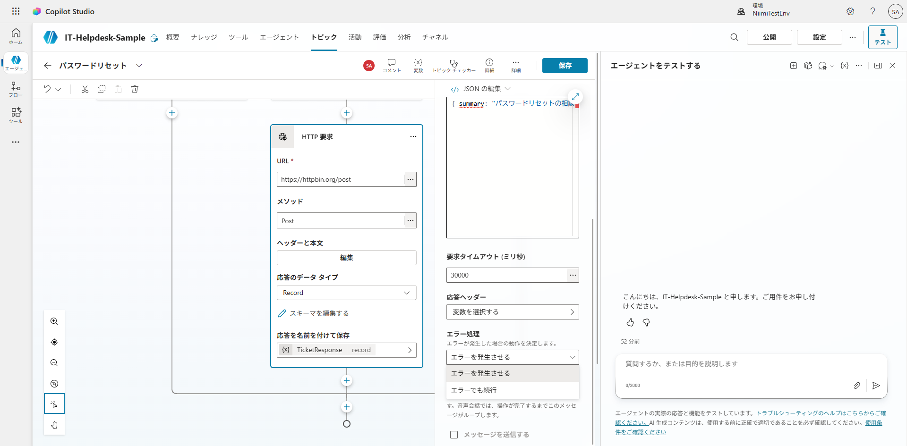

4. 「エラーでも続行」を選んだ場合は、**エラー応答の本文** の **変数を選択する** から `Var1`/任意の変数を作成し、後続ノードの条件分岐で復旧処理を行う

同サブパネル内には、エラー処理以外にも以下のオプションが並びます (必要に応じて調整):

- **要求タイムアウト (ミリ秒)**: 既定 30000 (= 30 秒)。長時間呼び出しを許容する API では延長
- **応答ヘッダー**: 出力ヘッダーを丸ごと変数 (Table 型) に保存
- **遅延メッセージ** (h3 セクション): **メッセージを送信する** チェックボックスを ON にすると、テキスト会話では 1 回、音声会話では完了までループで「処理中です」風のメッセージを再生

MS Learn 該当箇所: [HTTP request node を使用する (en-US)](https://learn.microsoft.com/ja-jp/microsoft-copilot-studio/authoring-http-node) (エラー処理、タイムアウト、遅延メッセージの仕様)

### 5.3 Power Automate フロー版 (任意・代替)

既存の Power Automate / Logic Apps 資産を呼び出したい場合、または `エージェントがフローを呼び出したとき` トリガーで Dataverse / Microsoft Graph / Teams など 1000+ コネクタを使いたい場合は、HTTP 要求ノードの代わりに **エージェント フロー** をツールとして追加します。

1. ノード追加 (+) → **ツールを追加する** をクリック
2. **ツールを追加する** ダイアログが開く (タブ: **基本ツール** / コネクタ / ツール、既定は **基本ツール** タブ)
3. **基本ツール** タブの一覧から **新しいエージェント フロー** (`エージェントにタスクを自動で完了させる`) を選択

   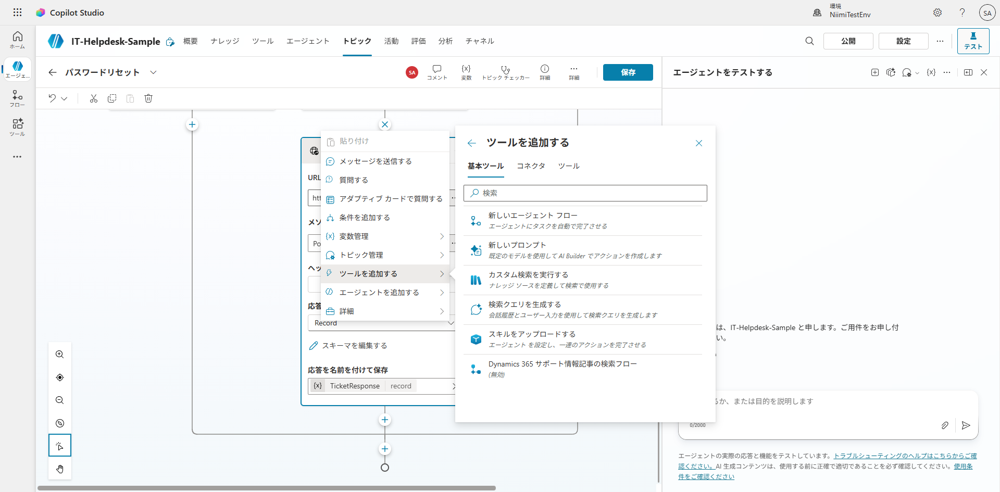

   - 同タブ内のその他の選択肢: **新しいプロンプト** (AI Builder の単発プロンプト) / **カスタム検索を実行する** (ナレッジ ソース) / **検索クエリを生成する** / **スキルをアップロードする**
   - 既存のフローを再利用する場合は、ダイアログ内の検索ボックスまたは **ツール** タブから既存のエージェント フローを選択

4. **新しいエージェント フロー** を選ぶと Power Automate のエージェント フロー デザイナーが新規タブで開き、以下が既定で配置済みになります:
   - トリガー: **エージェントがフローを呼び出したとき** (`When an agent calls the flow`)
   - 応答アクション: **エージェントに応答する** (`Respond to the agent`)
5. トリガーの **入力パラメーター** にトピックから受け渡したい変数 (`UserId`, `IssueType` など) を定義 → 中間でコネクタ アクション (Dataverse 行作成、Teams 投稿など) を組み立て → **エージェントに応答する** の **出力パラメーター** に返却値を定義
6. **公開** をクリック → タブを閉じて Copilot Studio に戻ると、トピックに **Action ノード** として配置済み
7. Action ノードの入力にトピック変数をマッピング、出力をトピック変数に格納

> ⚠️ **制約**: 「エージェントに応答する」アクションは **非同期モード OFF 必須** で、**100 秒以内** に応答する必要があります (それ以降の処理は応答アクションの後ろに置けば最大 30 日継続可能)。

MS Learn 該当箇所: [エージェント フローをツールとして作成する (en-US)](https://learn.microsoft.com/ja-jp/microsoft-copilot-studio/advanced-flow-create)

---

## 6. Phase 5 — テスト ペインで動作確認

MS Learn 該当箇所: [エージェントをテストする (en-US)](https://learn.microsoft.com/ja-jp/microsoft-copilot-studio/authoring-test-bot)

テスト ペインは既定で**画面右側に常時表示**されています (表示されていない場合は、エージェント上部ツールバー右端の **テスト** ボタンで切り替え)。テスト ペイン上部ツールバーには以下のボタンが並びます:

| ボタン | 役割 |
| --- | --- |
| 🔄 **新しいテスト セッションを開始する** | 会話履歴をリセットして最初から |
| **評価** (`IT-Helpdesk-Sample を評価する`) | 一括評価実行 (テストケース投入) |
| **チャット モード** | チャット / 音声 などの応答モード切り替え |
| **変数** | トピック変数の現在値を確認 |
| **詳細** | 後述のサブメニュー (活動マップ表示、トピック間追跡、スナップショット保存など) |
| **テスト ウィンドウの展開** / **コントラクト テスト ウィンドウ** | ペインのフロート/ドック切替 |
| **テスト ペインを閉じる** | ペインを隠す |

<!-- ### 6.1 シナリオ実行 -->

<!-- 1. テスト ペイン下部の入力欄 **質問するか、または目的を説明します** に `パスワード忘れた` と入力して送信 → **パスワードリセット** トピックが発火し、ボットが `お使いの PC は社内 PC ですか、社外 PC ですか?` と質問。選択肢は入力欄上部の **「推奨されるアクション」** バー (Suggested Actions) として `社内PC` / `社外PC` の 2 ボタンが表示されます -->

   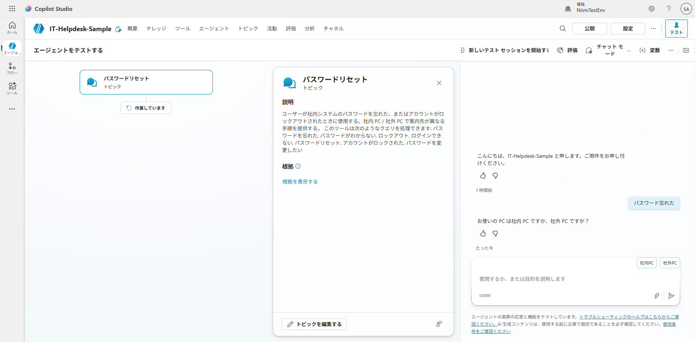

<!-- 2. **社内PC** ボタンをクリック → 「社内 PC をお使いの場合は、セルフサービス リセット ポータル `https://passwordreset.contoso.local` から再設定してください。アカウントは 5 回失敗で 30 分間ロックされます。」と返ってくることを確認

   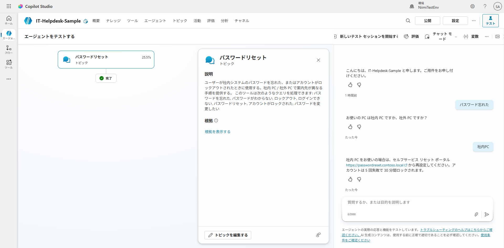 -->

<!-- 3. ツールバー左端の 🔄 **新しいテスト セッションを開始する** で会話をリセットし、再び `パスワード忘れた` → **社外PC** を選択 → 「社外 PC の場合は IT ヘルプデスク (内線 8888 / `helpdesk@contoso.com`) にご連絡ください。」と返ってくることを確認。社外 PC ブランチには 5 章で追加した HTTP 要求ノードが含まれるため、左パネルのトピック追跡に **完了 (実行時間)** が表示されます (例: `22.91s`)

   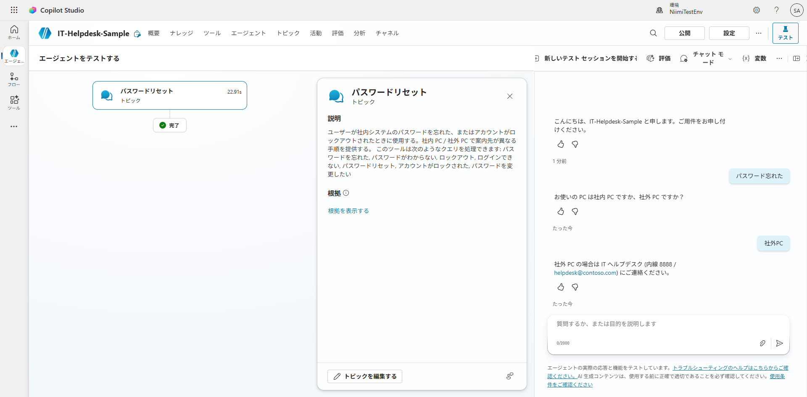

4. (ナレッジを設定している場合) `MFA はどう設定する?` 等のクエリで `it-policy.md` 等からの引用 + `[filename]` 出典が返ってくることを確認

### 6.2 詳細メニュー (テスト ペイン上部)

**詳細** ボタンを開くと以下のサブメニューが表示されます:

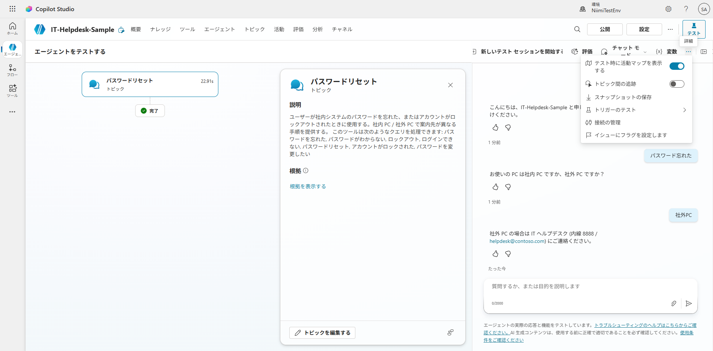

| 項目 | 種別 | 役割 |
| --- | --- | --- |
| **テスト時に活動マップを表示する** | switch (既定 ON) | トピック発火時にテスト ペイン上部にトピック カード (説明・根拠) を表示 |
| **トピック間の追跡** | switch (既定 OFF) | トピック間の遷移を会話履歴の右側に時系列で重ねて表示 |
| **スナップショットの保存** | menuitem | 現在の会話ログを JSON でダウンロード (障害解析・再現用) |
| **トリガーのテスト** | menuitem | 自動トリガー (イベント) を手動で発火させてテスト |
| **接続の管理** | menuitem | テスト セッションが使うコネクタ接続を切り替え |
| **イシューにフラグを設定します** | menuitem | Microsoft へのフィードバック送信 | -->

<!-- ### 6.3 HTTP 要求の応答を可視化する (オプション)

5 章で追加した HTTP 要求ノードは、テスト ペインから「動いたかどうか」だけは観察できますが、**リクエスト Body / レスポンス Body / ステータス コード を直接見る UI はありません**。テスト ペインで観察できる範囲は以下に限られます。

| 観察対象 | 場所 | 何が分かるか |
| --- | --- | --- |
| ボットが次のメッセージへ進んだか | チャット履歴 | 後続の「メッセージを送信する」ノードが応答した = HTTP 要求が **成功** (2xx 想定) |
| トピック全体の実行時間 | 左パネル トピック追跡カード | `完了 27.86s` のような表示。HTTP 応答待ち時間込み |
| 応答変数のスキーマ | 上部ツールバー **変数** ボタン | `Topic.TicketResponse (record)` / `.status (string)` / `.ticket_id (string)` がリストに出る = HTTP ノードが実行され、サンプル JSON から派生した変数が作られた証拠 (※ **値そのものは表示されません** — スキーマのみ) |
| 失敗時のエラー | チャット履歴 + 活動マップ | エラー処理が既定 (`エラーを発生させる`) のままなら、トピックが中断されてエラー メッセージが返る |

レスポンス Body の **実値** や、HTTP 要求が運んだ JSON を画面で確認したい場合は、検証用に **「メッセージを送信する」ノードを社外 PC ブランチに一時追加** して、Power Fx 式でエコー表示するのが最も簡単です。

1. 社外 PC ブランチの **HTTP 要求の送信** ノード直後に **+ → メッセージを送信する** を追加
2. メッセージ本文に `チケット番号: {Topic.TicketResponse.ticket_id} / ステータス: {Topic.TicketResponse.status}` のような Power Fx 式を埋め込む (`{ }` の中はトークンとして変数を選択)
3. 保存 → テスト ペインで `パスワード忘れた` → **社外PC** → エコー メッセージで実値が表示されることを確認
4. 検証が終わったら、追加した「メッセージを送信する」ノードは **削除して本番フローに戻す**

> 💡 `httpbin.org/post` はリクエスト Body をそのまま `json` フィールドに反映して返すので、サンプル JSON に `args` / `data` / `json` を含めておけば、**送信した内容も** エコーバックで確認できます。本番 API では PII を含む値をエコー表示しないよう注意してください。

--- -->

### 6.4 評価機能 (Agent Evaluation) — 自動化された一括テスト

§6.1〜§6.3 の **テスト ペイン** は 1 件ずつ手動で対話する「テスト チャット」用 UI で、同じ質問を繰り返し再現したり、複数質問に対するスコアを集計したりするには別の機能を使います。Microsoft Copilot Studio には独立した **エージェント評価 (Agent Evaluation)** 機能があり、テスト ケースを **テスト セット** にまとめて一括実行し、評価メソッド (graders) でスコアリングできます。

**本手順書での扱い**: 本デモでは Phase 5 までで「動作する」ことの確認 (手動の Test pane 単発実行) を行ったうえで、**Agent Evaluation を 1 回実機実行**しています (10 件・全般的な品質 / 結果スコア **70%**)。実行記録・スクリーンショット・失敗ケースの所見は **§6.4.8 実機検証結果**を参照してください。本節 (§6.4.1〜§6.4.7) では、シナリオ A 以降の Microsoft Foundry 側評価 (シナリオ A README §6) と並べて比較できるよう、Microsoft Copilot Studio 側の評価機能の入口と公式リファレンスをまとめます。

#### 6.4.1 公式リファレンス

公式 (Microsoft Learn): [エージェント評価について - Microsoft Copilot Studio](https://learn.microsoft.com/ja-jp/microsoft-copilot-studio/analytics-agent-evaluation-intro)

| 項目 | 公式 (Microsoft Learn) |
|---|---|
| 機能概要 | [エージェント評価について](https://learn.microsoft.com/ja-jp/microsoft-copilot-studio/analytics-agent-evaluation-intro) |
| テスト セット作成 (単一応答) | [単一の応答テストセットを作成する](https://learn.microsoft.com/ja-jp/microsoft-copilot-studio/analytics-agent-evaluation-create) |
| テスト セット作成 (会話型) | [会話型テストセットを作成する](https://learn.microsoft.com/ja-jp/microsoft-copilot-studio/analytics-agent-evaluation-multi-turn) |
| 評価メソッド (graders) | [評価メソッドを選択する](https://learn.microsoft.com/ja-jp/microsoft-copilot-studio/analytics-agent-evaluation-overview) |
| 評価実行と結果表示 | [評価を実行し結果を表示する](https://learn.microsoft.com/ja-jp/microsoft-copilot-studio/analytics-agent-evaluation-results) |
| API による自動化 (CI/CD) | [Power Platform REST API で評価を自動化する](https://learn.microsoft.com/ja-jp/microsoft-copilot-studio/analytics-agent-evaluation-rest-api) |
| テスト ケース編集 | [テストケースを編集する](https://learn.microsoft.com/ja-jp/microsoft-copilot-studio/analytics-agent-evaluation-edit-cases) |

#### 6.4.2 機能の位置づけ — Test chat と Agent Evaluation の違い

| 観点 | Test chat (§6.1〜6.3) | Agent Evaluation (本節) |
|---|---|---|
| 用途 | 1 件ずつ手動で対話、UI で動作確認 | 複数テスト ケースを一括実行・スコアリング |
| 再現性 | 低 (毎回手動入力) | 高 (同じテスト セットを何度でも) |
| スコアリング | なし (目視) | LLM 判定 / 類似度 / キーワード / 完全一致 / ツール利用 / カスタム |
| 結果保存 | なし (会話ログをスナップショット手動保存のみ) | **89 日保持** (CSV エクスポート可) |
| 入口 | 上部ツールバー右端の **テスト** ボタン | 左サイド メニュー / テスト ペイン右上 **評価** (`<エージェント名> を評価する`) ボタン |
| 想定ユーザー | 開発中の Maker | リリース判定者 / QA / CI/CD |

#### 6.4.3 評価メソッド (graders) 早見表

| メソッド | テスト セット種別 | スコア | 設定が必要な項目 |
|---|---|---|---|
| **一般的な品質** | 単一/会話 | 100 点満点 | (なし。LLM が関連性 / グラウンディング / 完全性を判定) |
| **意味の比較** | 単一 | 100 点満点 | 合格スコア / 期待される応答 |
| **能力の利用** | 単一 | 合格/不合格 | 期待される能力 (ツール / トピック / ナレッジ) |
| **キーワード マッチ** | 単一/会話 | 合格/不合格 | 期待されるキーワード or フレーズ |
| **テキストの類似性** | 単一 | 100 点満点 | 合格スコア / 期待される応答 (※ GCC 環境では不可) |
| **完全一致** | 単一 | 合格/不合格 | 期待される応答 |
| **Custom** | 単一/会話 | 合格/不合格 (定義ラベル) | 名前 / 評価手順 / ラベル |

#### 6.4.4 評価実行手順 (公式手順をベースにした最小フロー)

1. エージェントの **評価** ページに遷移 (左サイド メニュー、または Test pane 右上の **評価** ボタン → ページが新規タブで開く)
2. **\[新しい評価\]** → **単一の応答** を選択
3. テスト セット作成方法を選ぶ:
   - **手動作成** — UI で 1 件ずつ追加 (推奨: まずは 3〜5 件)
   - **CSV インポート** — `Question, 予想される応答, テスト方法` の 3 列 CSV (最大 100 件 / 1 問 1,000 文字以内)
   - **ナレッジ / トピックから AI 生成** — `it-policy.md` 等の知識ソースから自動生成 (本デモのナレッジ向け)
   - **テーマから生成** — 本番運用後、Analytics の Themes から実ユーザー質問を取り込み
4. **テスト方法**を 1 つ以上選択 (本デモ向け推奨: `一般的な品質` + `キーワード マッチ`)
   - `キーワード マッチ`: 例えば「パスワード忘れた → 社外 PC」の応答に `8888` / `helpdesk@contoso.com` を含むかを判定
5. 各テスト ケースに **期待される応答 / キーワード** を入力 (`一般的な品質` のみは任意)
6. **ユーザー プロファイル** を選択 (本デモのようにナレッジ・コネクタとも認証なしなら「認証なし」で続行)
7. **\[評価\]** を選択して即時実行 (or **\[保存\]** で後日実行)
8. 実行結果を確認: 合計スコア、テスト ケース毎の合否、応答全文、トリガーされたトピック / 利用したナレッジ、活動マップ

#### 6.4.5 本デモ用テスト セットの例 (CSV インポート向け)

`IT-Helpdesk-Sample` 用の最小テスト セット (5 件、CSV テンプレ):

```csv
Question,予想される応答,テスト方法
パスワード忘れた。社内 PC を使っています,セルフサービス リセット ポータルから再設定してください,キーワードマッチ
パスワード忘れた。社外 PC を使っています,IT ヘルプデスク (内線 8888) にご連絡ください,キーワードマッチ
MFA はどう設定する?,Microsoft Authenticator,キーワードマッチ
社内 PC のアカウントは何回失敗するとロックされる?,5,完全一致
PC が起動しない,(なし),一般的な品質
```

> 💡 `予想される応答` に長文を書く必要はありません。`キーワードマッチ` であれば短いキーワード文字列、`完全一致` であれば応答そのもの、`一般的な品質` のみは空欄でも可です。

#### 6.4.6 制約と注意点

- **テスト セット 1 つあたり最大 100 ケース** / **質問 1 件あたり 1,000 文字以内**
- **結果は 89 日間のみ保持** (長期保管は CSV エクスポートで対応)
- **テスト ケース AI 生成は Content Moderation 違反で 1 件でもブロックされると失敗** (= 厳しめのコンテンツ制御 / 機密ナレッジを使うエージェントは AI 生成より手動 / CSV インポート推奨)
- **責任ある AI レビューや Content Safety フィルターの代替にはならない** (Evaluation は精度測定であり、ハーム検出は別レイヤー)
- **GCC 環境では `テキストの類似性` メソッドとユーザー プロファイル追加が不可** (公式記載)
- **テスト アカウントの権限**で知識ソース / コネクタにアクセスするため、実行アカウントが持つ機密データがテスト ケースに含まれる可能性あり (機密区分の事前確認必須)

#### 6.4.7 シナリオ A〜F + H での扱い

- **シナリオ A〜C (Microsoft Foundry 移行系)**: 移行先 Microsoft Foundry agent には **別途 Foundry portal の評価機能 (Evaluations)** があり、データセット / Evaluators / トレース連携が GA 済 ([Microsoft Foundry の評価機能 (ja-jp)](https://learn.microsoft.com/ja-jp/azure/ai-foundry/concepts/evaluation-approach-gen-ai))。移行前後で**同じテスト ケースを両側に流して結果を比較**するのが理想 (本手順書では Phase 5.5 = Microsoft Copilot Studio 側、シナリオ A README §6 = Microsoft Foundry 側)
- **シナリオ D / E / F (Microsoft Copilot Studio 温存系)**: Microsoft Copilot Studio 側の Agent Evaluation を継続利用。Microsoft Foundry agent / モデル / MCP server を呼び出す部分は **会話型テスト セット** で end-to-end 検証する
- **シナリオ H (APIM AI Gateway)**: APIM の token-limit や semantic-cache 適用前後で同じテスト セットを流し、応答品質に劣化が無いか確認する用途で有効

#### 6.4.8 実機検証結果 (本デモでの実行記録)

本リポジトリの IT-Helpdesk-Sample エージェントに対して、上記 §6.4.4 の手順で **Agent Evaluation を 1 回実行した結果を記録**します。シナリオ A 以降で Microsoft Foundry 側 (Evaluations) と比較する際の Microsoft Copilot Studio 側の **ベースライン スコア**として利用してください。

**実行条件**:

| 項目 | 値 |
| --- | --- |
| エージェント | IT-Helpdesk-Sample (本手順書 Phase 0〜5 で構築) |
| データ型 | 単一応答 |
| テスト セット生成方法 | クイック質問セット (エージェント説明から AI で 10 件自動生成) |
| テスト方法 (grader) | 全般的な品質 (LLM 採点、合格/不合格) のみ |
| ユーザー プロファイル | 未設定 (本エージェントはツール未使用のため不要) |
| 実行日時 | 2026-05-26 09:15 (JST) |

**手順実行ログ**:

1. エージェント ヘッダー上部の **評価** タブを開く → 初期状態は空で、中央に「エージェントのパフォーマンスを評価する」と **テスト セットを作成する** ボタンが表示される

   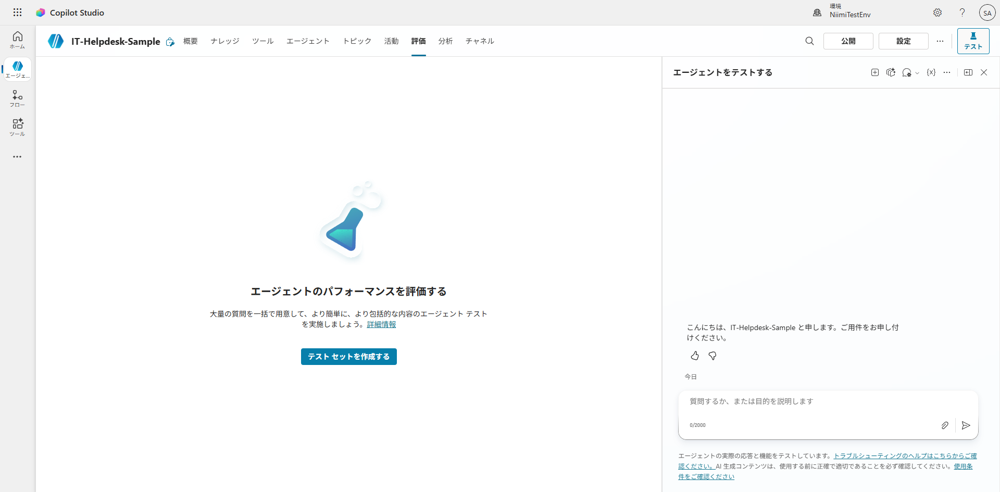

2. **テスト セットを作成する** をクリック → 「**新しい評価**」フォームが開く。データ型 = 単一応答 / 会話 (プレビュー)、データ ソースは CSV ドラッグ&ドロップ / **クイック質問セット** / **完全な質問セット** / **テスト チャット会話を使用する** / **または、自分自身で質問を書きます** から選択

   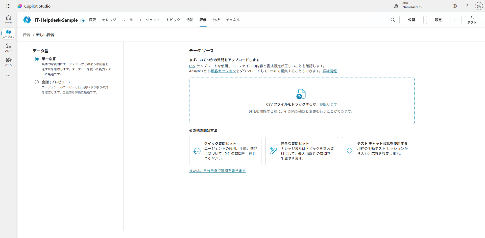

3. ローコード優先で **クイック質問セット** (エージェント説明から AI が 10 件自動生成) を選択 → IT ヘルプデスク向け 10 件 (パスワード リセット / MFA / アカウント ロック / IT 規定 / セキュリティ インシデント / メール / エスカレーション / PC 動作 / 社員アカウント作成 ほか) が自動投入される。右ペイン「テストセットを構成する」でテスト方法 = **全般的な品質** がデフォルトで 1 件追加済

   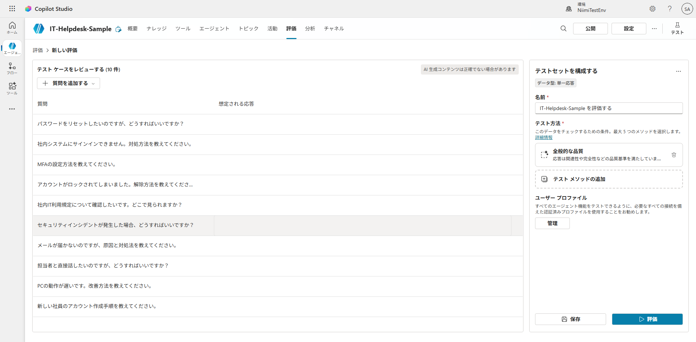

4. 右下の **評価** ボタンをクリック → テスト セットが保存され、評価一覧ページに戻ると **テスト セット** カードに登録済になる。「最近の結果」はまだ空

   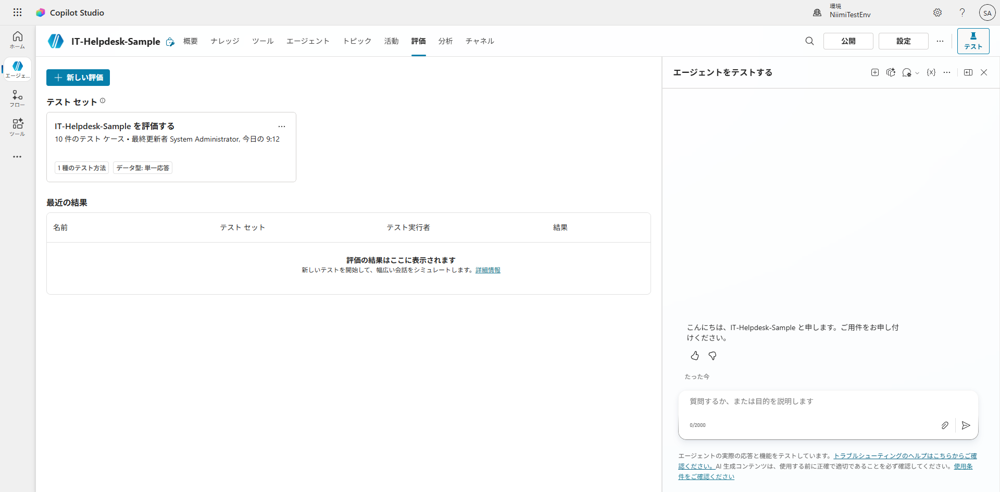

5. テスト セット カード上の **テスト セットの評価** (▶) ボタンをクリック → 「**プロファイルと接続の管理**」ダイアログが開く。本エージェントはツール (Connector) 接続が無いのでアカウント選択せずに **実行**

   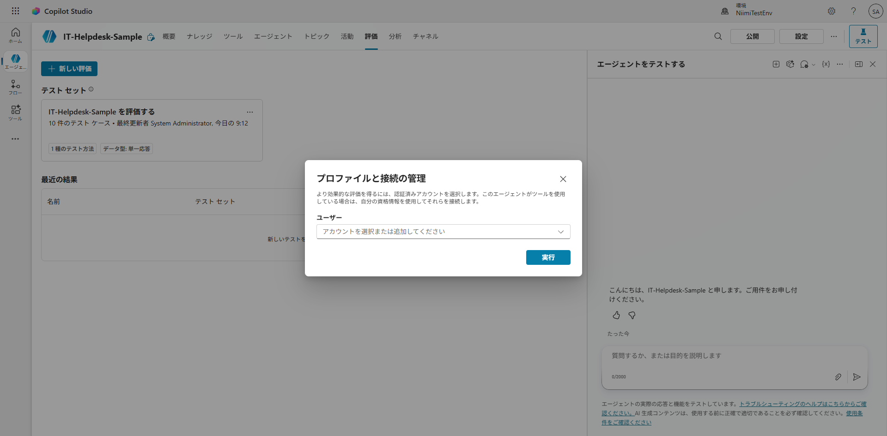

6. 評価 (Run) が開始され URL が `/evaluation/runsDetails/{runId}/{testSetId}` に遷移。「**評価の概要**」右ペインの **テスト ケース** カウンタ (例: `4/10`) と **実行時間** がインクリメントしていく

   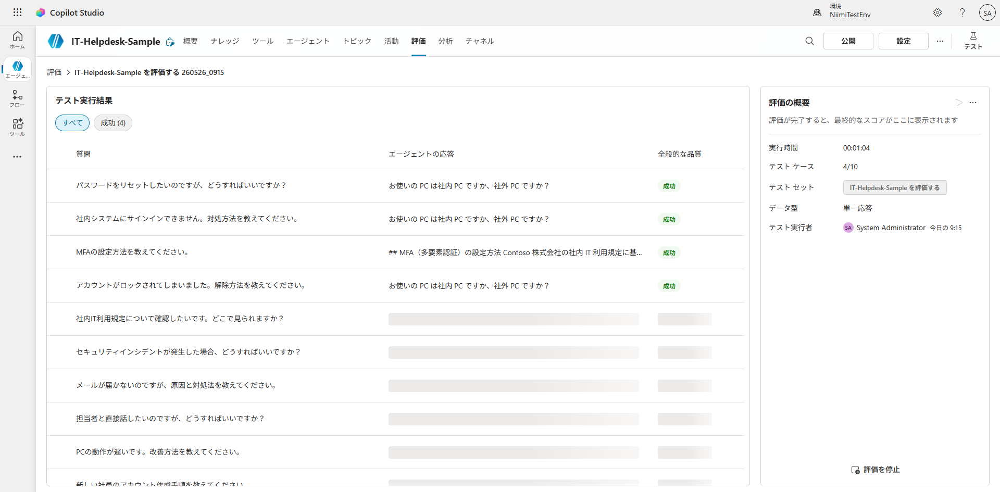

7. 全 10 件 (約 4 分 28 秒) 完了 → 右ペインに **スコア** が表示される。本実行は **70%** (10 件中 **成功 7 / 失敗 3**)

   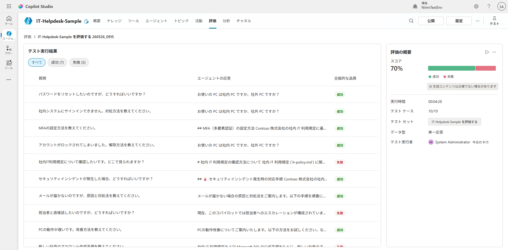

8. **失敗 (3)** フィルタ チップをクリックして失敗ケースだけを表示

   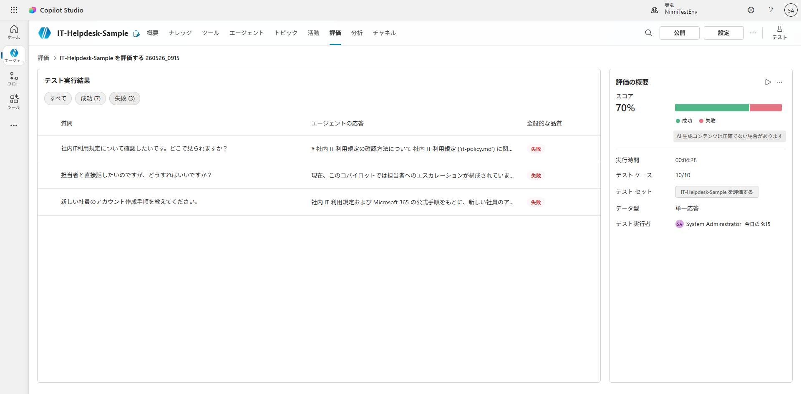

9. 失敗行をクリックすると右ペインに **テスト ケースの詳細** が開く。`全般的な品質` グレーダーの判定理由が 🟢 「関連性があるように見えます」/ 🔴 「完結していないようです」のように **チェック項目単位**で表示される

   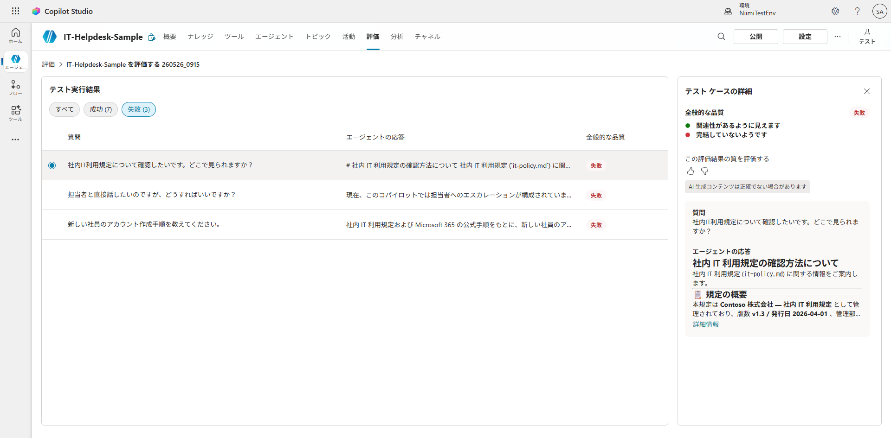

**失敗 3 件と原因の所見** (本デモでの観察):

| # | 質問 | エージェント応答の特徴 | グレーダー判定 | 推測される改善余地 |
| --- | --- | --- | --- | --- |
| 5 | 社内 IT 利用規定はどこで見られますか? | 内部ファイル名 `it-policy.md` を出力。掲載 URL は「社内ポータルをご確認ください」とだけ案内 | 関連性 ✅ / 完結性 ❌ | instructions に「ナレッジ ファイル名は出力しない」「実際の URL を明示する」を追記する |
| 8 | 担当者と直接話したい | 「現在、このコパイロットでは担当者へのエスカレーションが構成されていません」と機能未実装を率直に回答 | 関連性 ✅ / 完結性 ❌ | エスカレーション フロー (人手引き継ぎ トピック) を実装するか、代替連絡手段を案内する |
| 10 | 新しい社員のアカウント作成手順 | 詳細な手順を出力したが、回答中に複数箇所で `it-policy.md` が露出 | 関連性 ✅ / 完結性 ❌ | 同上 (ファイル名漏えい) — instructions の見直しで改善見込み |

**この検証から得られる示唆**:

- **大量質問の一括検証は手動 Test chat より圧倒的に高効率**: 10 件 × 約 27 秒/件 = 4 分 28 秒で品質の傾向を把握できた。手動なら 10 件のチャット セッションを順に開いて 1 件ずつ判断する必要があり、所要時間 + ヒューマン エラーで現実的でない
- **AI 採点 (`全般的な品質`) は思ったより厳しい**: 「関連性 OK + 完結性 NG」の組合せで失敗判定が出るため、表面的な応答品質より一段深い改善材料が得られる
- **本デモの 70% は移行判定の妥当な開始点**: シナリオ A〜C で Microsoft Foundry 移行後、Foundry portal の Evaluations で同じ 10 件 (またはエクスポートした CSV) を流し、**70% よりスコアが向上していれば移行のメリットが定量的に示せる**
- **失敗原因の分類が次のアクションを明確化**: ナレッジ整形 (`#5, #10`)、未実装機能の追加 (`#8`) のように、instructions / トピック / ナレッジのどの層を改善すべきかが切り分けやすい

> 💡 **シナリオ A〜C への引継ぎ**: 上記 10 件の質問は **シナリオ A README §6 (Microsoft Foundry のプレイグラウンド検証)** や、Foundry Evaluations で同じテスト セットを使う際の **共通質問プール**として再利用できます。CSV 形式でエクスポートしたい場合は「**テスト セット詳細**」ページ右上の **その他のオプション** → **エクスポート** を使ってください (Microsoft Learn 引用: [評価のテスト ケースを編集する (ja-jp)](https://learn.microsoft.com/ja-jp/microsoft-copilot-studio/analytics-agent-evaluation-edit-cases))。

--- 

## 7. Phase 6 — 公開 (任意)

MS Learn 該当箇所: [重要な概念 - エージェントの公開と展開 (en-US)](https://learn.microsoft.com/ja-jp/microsoft-copilot-studio/publication-fundamentals-publish-channels)

シナリオ D (Copilot Studio + Foundry 併用) を行う場合、Copilot Studio 側を Microsoft Teams または Microsoft 365 に公開した状態にしておくことが推奨です。シナリオ A〜C のみであれば公開不要。

### 7.1 公開

1. エージェント上部ツールバーの **公開** ボタンをクリック → ダイアログ **「このエージェントを公開する」** が開く

   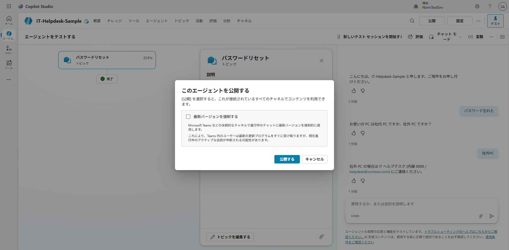

2. ダイアログ本文: 「[公開] を選択すると、これが接続されているすべてのチャネルでコンテンツを利用できます。」
3. 必要に応じて **最新バージョンを強制する** チェックボックスを ON にする
   - ON にすると、Microsoft Teams などの永続的なチャネルで進行中のチャットに最新バージョンを強制的に適用 (アクティブな会話が中断される代わりに、ユーザーは即座に最新版を利用可能)
   - OFF (既定) なら、進行中の会話は旧版で完了し、次の新規会話から新版に切り替わる
4. **公開する** をクリック (キャンセルする場合は **キャンセル**)

### 7.2 チャネルへ追加

1. エージェント ヘッダーの **チャネル** タブを開く

   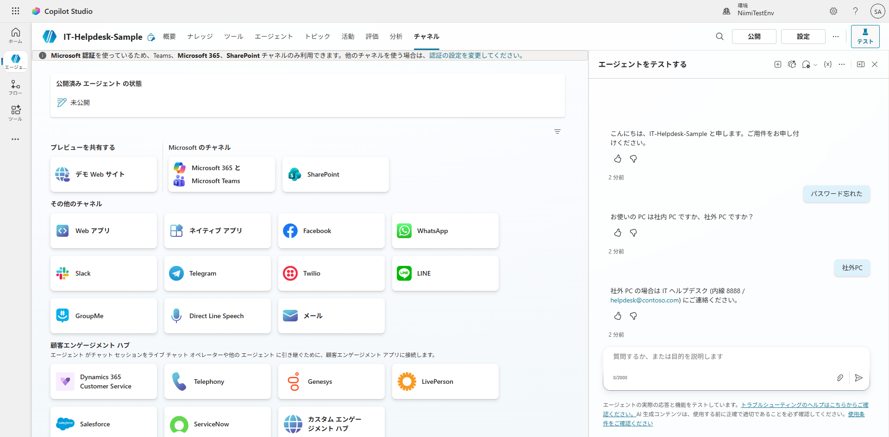

2. ページ上部に **公開済み エージェント の状態** (未公開 / 公開済み) が表示されます
3. 以下のセクションから追加したいチャネルを選択:

   | セクション | 主な選択肢 |
   | --- | --- |
   | **プレビューを共有する** | デモ Web サイト |
   | **Microsoft のチャネル** | Microsoft 365 と Microsoft Teams / SharePoint |
   | **その他のチャネル** | Web アプリ / ネイティブ アプリ / Facebook / WhatsApp / Slack / Telegram / Twilio / LINE / GroupMe / Direct Line Speech / メール |
   | **顧客エンゲージメント ハブ** | Dynamics 365 Customer Service / Telephony / Genesys / LivePerson / Salesforce / ServiceNow / カスタム エンゲージメント ハブ |

> 📌 **重要**: 本デモのように **Microsoft 認証** で作成したエージェントは、**Microsoft 365 と Microsoft Teams** / **SharePoint** / **デモ Web サイト** のみ利用可能です (画面上部に注意バナーが表示されます)。その他のチャネル (Slack 等) を使うには、エージェント設定 → セキュリティ → 認証 で「**ユーザーが手動でサインイン**」または「**認証なし**」へ切り替える必要があります (チャネル名のリンク経由でジャンプ可能)。

4. 公開後の変更は **新しい会話セッション**から反映 (Teams ではユーザーがチャットを再起動するか、約 30 分の無活動でセッション切れ)

---

## 8. Phase 7 — pac CLI でエクスポート (移行の核心)

シナリオ A〜D のいずれでも、ここで取得した YAML が Microsoft Foundry 側の設計インプットになります (シナリオ E / F では構成変更時の差分管理用)。

### 8.1 pac CLI のインストール

MS Learn 該当箇所: [Microsoft Power Platform CLI](https://learn.microsoft.com/ja-jp/power-platform/developer/cli/introduction) / [Install Microsoft Power Platform CLI - .NET tool](https://learn.microsoft.com/en-us/power-platform/developer/cli/install-cli-net-tool)

`pac` (Power Platform CLI) を **.NET Tool** として導入します。**現環境の .NET SDK バージョンに合わせて適切な版を選ぶ** のがポイントです (最新の v2.x は .NET 10 SDK 必須、.NET 9 SDK のみの環境では v1.52.1 が最終対応版)。

```powershell
# 1) 現在の .NET SDK を確認
dotnet --list-sdks
# 例: 9.0.314 [C:\Program Files\dotnet\sdk]   ← .NET 9 環境

# 2-A) .NET 10 SDK がある環境 → 最新版 (v2.x) をインストール
dotnet tool install --global Microsoft.PowerApps.CLI.Tool

# 2-B) .NET 9 SDK のみの環境 → 1.x の最終版を明示指定
dotnet tool install --global Microsoft.PowerApps.CLI.Tool --version 1.52.1

# 3) 動作確認
pac
# Microsoft PowerPlatform CLI
# Version: 1.52.1+gcca51f4 (.NET 9.0.16)
# ...
# Usage: pac [admin] [application] [auth] [canvas] [catalog] [code] [connection]
#            [connector] [copilot] [env] [help] [managed-identity] [modelbuilder]
#            [package] [pages] [pcf] [pipeline] [plugin] [power-fx] [solution]
#            [telemetry] [test] [tool]
```

<!-- > ⚠️ **インストール時に失敗するときの定番チェック**:
> - **`microsoft.powerapps.cli.tool ... NuGet フィードに見つかりません`**: 既定の NuGet ソースに `nuget.org` が登録されていない可能性。`dotnet nuget list source` で確認し、`Microsoft Visual Studio Offline Packages` しか無ければ `dotnet nuget add source https://api.nuget.org/v3/index.json --name nuget.org` で追加して再試行。
> - **`DotnetToolSettings.xml がパッケージで見つかりません`**: .NET SDK と dotnet tool の対象フレームワーク (TFM) が不一致。pac CLI 2.x の nupkg は `tools/net10.0/` のみ同梱されているため、.NET 9 SDK で最新版を入れようとするとこのエラーになります。**`--version 1.52.1` (tools/net9.0/ を含む 1.x 系の最終版) を指定** するか、.NET 10 SDK を導入してください。 -->

代替インストール手段:
- **Windows MSI**: [aka.ms/PowerPlatformCLI](https://aka.ms/PowerPlatformCLI) からダウンロード ([Install Power Platform CLI using Windows MSI](https://learn.microsoft.com/en-us/power-platform/developer/cli/install-cli-msi))
- **VS Code 拡張**: Marketplace から **"Power Platform Tools"** をインストール ([Install Microsoft Power Platform CLI for Visual Studio Code](https://learn.microsoft.com/en-us/power-platform/developer/cli/install-cli-vscode))

### 8.2 認証

MS Learn 該当箇所: [Microsoft Power Platform CLI auth コマンド グループ](https://learn.microsoft.com/ja-jp/power-platform/developer/cli/reference/auth)

pac CLI の認証は **認証プロファイル** という単位でローカルに保存されます。Windows + Microsoft Entra ID 連携のマシン (Microsoft 365 で既に組織テナントにサインイン中など) では、`UNIVERSAL` という OS 統合プロファイルが **`pac auth create` を実行しなくても** 自動で使えるケースがあります。まずは現状を確認しましょう。

```powershell
# 現在の認証プロファイル一覧
pac auth list
# Index Active Kind      Name User                    Cloud  Type            Environment Environment Url
# [1]   *      UNIVERSAL      user@contoso.com        Public OperatingSystem
#
# ↑ `Active` 列に `*` が付いていればそのプロファイルが選択中。
# ↑ `Type: OperatingSystem` の `UNIVERSAL` プロファイルは
#   Windows のサインイン アカウントを流用する pac 1.x 以降の機能。

# アクティブ プロファイルの詳細 (テナント / ユーザー / トークン期限)
pac auth who
# Connected as user@contoso.com
# Type:               OperatingSystem
# Cloud:              Public
# Tenant Id:          <TENANT-GUID>
# Authority:          https://login.microsoftonline.com/organizations

# 既存プロファイルが無い / 別アカウントを使いたい場合のみ手動作成
pac auth create

# 既定ブラウザが立ち上がらない環境 (リモート / Linux 等) は Device Code フロー
pac auth create --deviceCode

# 特定環境を既定として紐付けたい場合 (一意名 / GUID / URL のいずれかを指定)
pac auth create --environment "Contoso-Dev"
pac auth create --environment https://contoso.crm.dynamics.com/

# プロファイルが複数あるときの切り替え
pac auth select --index 2

# 認証が効いていることを環境一覧で確認 (alias: pac org list)
pac env list
# Active Display Name      Environment ID                       Environment URL                  Unique Name
#        Contoso-Dev       0e7534f7-9fb6-...                    https://contoso-dev.crm...       unq...
#        Contoso-Prod      f0c4897b-bf71-...                    https://contoso-prod.crm...      unq...
```

<!-- > 💡 **`Type: OperatingSystem` (UNIVERSAL プロファイル)** は pac CLI 1.x 以降で導入された Windows / Microsoft Entra ID 統合認証で、`pac auth create` を実行しなくても OS のログイン アカウントをそのまま使えます (社内 PC で同じテナントにサインイン済みなら、これだけで `pac env list` が通ります)。明示的に複数アカウント / 複数環境を管理したい場合は `pac auth create` でプロファイルを追加し、`pac auth select` で切り替えます。 -->

### 8.3 Bot ID の取得

MS Learn 該当箇所: [pac copilot list](https://learn.microsoft.com/ja-jp/power-platform/developer/cli/reference/copilot#pac-copilot-list)

**手段の1つ (推奨): Copilot Studio の URL から拾う**

エージェントを開いた状態のブラウザ URL は次の形をしています。`bots/` の直後の GUID が Bot ID。

```
https://copilotstudio.microsoft.com/environments/<ENV-ID>/bots/<BOT-ID>/...
                                                              ^^^^^^^^^
                                                              これが Bot ID
```

例: `https://copilotstudio.microsoft.com/environments/66170de3-7e57-e332-8207-18f50ffd589b/bots/a9a05814-d457-f111-a825-70a8a5027075/adaptive/.../triggers/main/actions/...`

→ Bot ID = `a9a05814-d457-f111-a825-70a8a5027075`


### 8.4 テンプレート エクスポート

MS Learn 該当箇所: [pac copilot extract-template](https://learn.microsoft.com/ja-jp/power-platform/developer/cli/reference/copilot#pac-copilot-extract-template)

```powershell
pac copilot extract-template `
   --environment https://<env-unique-name>.crm.dynamics.com/ `
   --bot a9a05814-d457-f111-a825-70a8a5027075 `
   --templateFileName .\IT-Helpdesk-Sample.yaml
```

実行ログ サンプル (本デモで実測):

```
Connected as admin@<tenant>.onmicrosoft.com
Loaded 16 components for copilot 'IT-Helpdesk-Sample' with id a9a05814-d457-f111-a825-70a8a5027075.
Primary language: Japanese, supported languages:
 -> C:\...\IT-Helpdesk-Sample.yaml
 -> C:\<cwd>\kickStartTemplate-1.0.0.json
```

> ℹ️ pac CLI のログは `Loaded 16 components` と表示しますが、YAML 内の実際の `kind:` 直下エントリ数は **15 個** (14 `DialogComponent` + 1 `FileAttachmentComponent`) です。差の 1 は内部カウント (BotDefinition ルート扱い) と推測されます。Diff / 自動検証時は YAML 側の実数を基準にしてください。

> ⚠️ **重要 — 出力形式と副産物**:
> 1. **メイン出力は単一 YAML ファイル** (`--templateFileName` で指定)。`bot.yaml + topics/ + actions/ + knowledge/` のディレクトリ構造ではありません。Topics / Entities / Knowledge 参照などすべての要素が `kind: BotDefinition` 1 ファイルにシリアライズされます。
> 2. **サイドカーで `kickStartTemplate-<version>.json` がカレント ディレクトリに生成** されます (`--templateName` / `--templateVersion` 未指定時は `kickStartTemplate-1.0.0.json`)。中身は **テンプレート メタデータ + エージェントの Instructions + customizations schema** です。`--templateFileName` で指定したパスと別の場所に落ちるので、不要なら `pac` 実行後に削除するか、デモ用のサブ ディレクトリで実行してください。

<!-- > 💡 過去の資料で「ディレクトリ構造で抽出される」と書かれていたら、それは `pac solution export` + `pac solution unpack` の話です (こちらは Solution 全体を unzip + 分解する別コマンド)。 -->

### 8.5 抽出に含まれる / 含まれない要素

MS Learn 該当箇所: [ソリューションを使ってエージェントをエクスポートおよびインポートする](https://learn.microsoft.com/ja-jp/microsoft-copilot-studio/authoring-export-import-bots)

本デモで実際に抽出された YAML (28 KB / 15 components ※pac CLI のログ表記は 16) の内訳:

| Component kind | 件数 | 内容 |
| --- | --- | --- |
| `DialogComponent` | 14 | 全 Topic (システム トピック含む。例: `会話の開始` / `会話の終了` / `フォールバック` / `エラー発生時` / `エスカレートする` / `あいさつ` / Phase 5 で追加した `パスワードリセット` など) |
| `FileAttachmentComponent` | 1 | Knowledge ソースの **参照のみ** (`it-policy.md`)。ファイル本体のバイト列は含まれない |

Topic 内のアクションも展開され、`kind: HttpRequestAction` (`url: https://httpbin.org/post`) や `kind: Question` / `kind: ConditionGroup` / `kind: SendActivity` / `kind: OAuthInput` / `kind: SearchAndSummarizeContent` 等が Power Fx 式付きでそのまま YAML に書き出されます。

サイドカーの `kickStartTemplate-1.0.0.json` には、エージェントの **Instructions (システム プロンプト)** や `customizations.schema` (overridable プロパティ) が格納されます。

| 区分 | 内容 |
|---|---|
| ✅ **YAML に含まれる** | `entity:` (accessControlPolicy / authenticationMode 等) / 全 Custom + System topic の `dialog.beginDialog.actions` ツリー / Topic 内の HTTP 要求 (`HttpRequestAction` の URL / Method / Headers / Body / Response schema) / Power Fx 式 / Question ノードの選択肢 / 変数 / `schemaName` / `parentBotId` |
| ✅ **メタ JSON に含まれる** | エージェントの `instructions` / `displayName` / `description` / `customizations.schema` |
| ⚠️ Solution export 限定 | Power Automate Flow (Solution エクスポートで `Add required objects` 必須) / 環境変数の **定義のみ** (値は除外) |
| ❌ **含まれない** | **Knowledge ファイルの中身** (`FileAttachmentComponent` には `displayName` / `schemaName` / `description` のみで本体は無し) / SharePoint / 公開 Web URL の再設定 / Connection の認証情報 / Adaptive Card の外部 URL 資産 / アイコン (`iconBase64: null`) / Channel 設定 / Conversation ID 等の環境固有 ID / コメント |

> ⚠️ **環境固有の publisherUniqueName**: 各コンポーネントの `publisherUniqueName` (例: `DefaultPublisherniimitestenv`) と `schemaName` のプレフィックス (例: `template-content.topic.cra72_it_helpdesk_sample.topic.*` の `cra72_` 部分) は **抽出元環境のソリューション発行者プレフィックス**に依存します。別環境へインポートするとき、ターゲット環境のソリューション発行者と一致しないと衝突するため、Foundry / 別 Power Platform 環境へ持っていく際は手動で書き換える (もしくはターゲット環境側で発行者を合わせる) 必要があります。

つまり Foundry 側では、少なくとも以下を **手動で再構築** する必要があります:
- Knowledge (it-policy.md を Foundry の Vector Store に再アップロード)
- Connection / API キー / 認証情報
- Channel (Teams / Web / M365 等)
- Adaptive Card (使用していれば)

### 8.6 Solution 経由のフル エクスポート (代替)

Flow / 環境変数 / カスタム コネクタも含めて移行したい場合は **Solution エクスポート/インポート** を使用:

1. Copilot Studio ポータル → **Settings** → **Solutions** → Custom (Unmanaged) solution 作成
2. 既存エージェント追加 → **Advanced** → **Add required objects** で関連 Flow / Connector を取り込み
3. Export (Unmanaged のみ可能)
4. ターゲット環境で Import

---

## 9. 抽出した YAML を Foundry へ — シナリオ別に分岐

ここから先はシナリオによって受け皿が変わります。Microsoft Foundry agent を作るルート (A〜C / D)、Microsoft Copilot Studio を温存しつつモデル / MCP だけ Microsoft Foundry に頼るルート (E / F) の **6 通り** が用意されています:

| シナリオ | レイヤー | Foundry での受け皿 | YAML / 抽出物の使い方 | 状態 | 詳細 README |
|---|---|---|---|---|---|
| **A** | エージェント本体 (移行) | Prompt agent | Instructions / Knowledge 接続 / Action OpenAPI を Python SDK で 1 体登録 | ✅ GA | [`scenario-a-prompt-agent\README.md`](scenario-a-prompt-agent/README.md) |
| **B** | エージェント本体 (移行) | Workflow agent | Topic ダイアログ ツリーを Workflow YAML / ビジュアル ビルダーに変換 | ⚠️ Preview | [`scenario-b-workflow-agent\README.md`](scenario-b-workflow-agent/README.md) |
| **C** | エージェント本体 (移行) | Hosted agent | コードで再実装し、コンテナとして ACR → Foundry 登録 | ⚠️ Preview | [`scenario-c-hosted-agent\README.md`](scenario-c-hosted-agent/README.md) |
| **D** | エージェント間連携 | Foundry agent を `Add an agent` で接続 | Microsoft Copilot Studio をそのまま残し、Foundry agent (= A/B/C) を `Add an agent → Microsoft Foundry` で接続 | ⚠️ Preview | [`scenario-d-cs-plus-foundry\README.md`](scenario-d-cs-plus-foundry/README.md) |
| **E** | モデル / ツール単位 | Foundry モデル デプロイ (BYOM) | Microsoft Copilot Studio の Prompt ツールの **Model** に Foundry モデルを接続 (YAML は使わず、Prompt Instructions を新規作成) | ✅ GA | [`scenario-e-byom-foundry-model\README.md`](scenario-e-byom-foundry-model/README.md) |
| **F** | モデル / ツール単位 | MCP server (Foundry / 任意ホスト) | Microsoft Copilot Studio の Tools に `Model Context Protocol` で接続 (YAML は使わず、MCP server 側の tool 定義を利用) | ✅ GA | [`scenario-f-mcp-connection\README.md`](scenario-f-mcp-connection/README.md) |

> 💡 **シナリオ A〜D は `pac copilot extract-template` の YAML が設計インプット**になります。E / F は Microsoft Copilot Studio エージェント本体を変更しない (Prompt / Tool を追加するだけ) ため、YAML 抽出は必須ではありません (構成変更後の差分管理用に取得しておくのは推奨)。

---

## 10. クイック リファレンス: MS Learn 該当箇所

| トピック | 記事 |
|---|---|
| Copilot Studio ライセンス比較 | [Copilot Studio にアクセスする](https://learn.microsoft.com/ja-jp/microsoft-copilot-studio/requirements-licensing-subscriptions) |
| 環境の初期構成 | [Power Platform 環境に関する作業](https://learn.microsoft.com/ja-jp/microsoft-copilot-studio/environments-first-run-experience) |
| エージェント作成 (クイックスタート) | [エージェントの作成と削除](https://learn.microsoft.com/ja-jp/microsoft-copilot-studio/authoring-first-bot) |
| ナレッジ全般 | [知識源の概要](https://learn.microsoft.com/ja-jp/microsoft-copilot-studio/knowledge-copilot-studio) |
| ナレッジ (ファイル アップロード) | [ナレッジ ソースとしてファイルをアップロードする](https://learn.microsoft.com/ja-jp/microsoft-copilot-studio/knowledge-add-file-upload) |
| トピック作成 | [トピックの作成と編集](https://learn.microsoft.com/ja-jp/microsoft-copilot-studio/authoring-create-edit-topics) |
| トリガー フレーズ設計指針 | [効果的なトリガーフレーズを設計しましょう](https://learn.microsoft.com/ja-jp/microsoft-copilot-studio/guidance/trigger-phrases-best-practices) |
| 質問ノード | [質問する](https://learn.microsoft.com/ja-jp/microsoft-copilot-studio/authoring-ask-a-question) |
| 条件 + Power Fx | [トピックに条件を追加する](https://learn.microsoft.com/ja-jp/microsoft-copilot-studio/authoring-using-conditions) |
| Copilot Studio の Power Fx | [Power Fx を使用して式を作成する](https://learn.microsoft.com/ja-jp/microsoft-copilot-studio/advanced-power-fx) |
| HTTP 要求ノード | [HTTP 要求を行う](https://learn.microsoft.com/ja-jp/microsoft-copilot-studio/authoring-http-node) |
| Power Automate フロー アクション | [エージェント フローをツールとして作成する](https://learn.microsoft.com/ja-jp/microsoft-copilot-studio/advanced-flow-create) |
| テスト ペイン | [エージェントをテストする](https://learn.microsoft.com/ja-jp/microsoft-copilot-studio/authoring-test-bot) |
| エージェント評価 (Agent Evaluation) | [エージェント評価について](https://learn.microsoft.com/ja-jp/microsoft-copilot-studio/analytics-agent-evaluation-intro) |
| 公開 / チャネル | [重要な概念 - エージェントの公開と展開](https://learn.microsoft.com/ja-jp/microsoft-copilot-studio/publication-fundamentals-publish-channels) |
| ソリューションのエクスポート / インポート | [ソリューションを使ってエージェントをエクスポートおよびインポートする](https://learn.microsoft.com/ja-jp/microsoft-copilot-studio/authoring-export-import-bots) |
| pac CLI インストール | [Microsoft Power Platform CLI](https://learn.microsoft.com/ja-jp/power-platform/developer/cli/introduction) |
| pac auth | [Microsoft Power Platform CLI auth コマンド グループ](https://learn.microsoft.com/ja-jp/power-platform/developer/cli/reference/auth) |
| pac copilot | [Microsoft Power Platform CLI コパイロット コマンド グループ](https://learn.microsoft.com/ja-jp/power-platform/developer/cli/reference/copilot) |
| クォータ / 制限 | [クォータと制限](https://learn.microsoft.com/ja-jp/microsoft-copilot-studio/requirements-quotas) |
