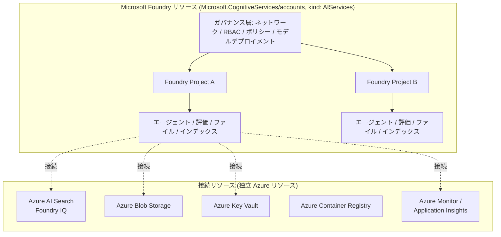
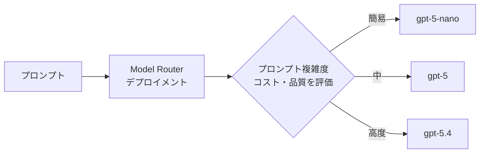

# Microsoft Foundry この1年のアップデート総まとめ（2025年5月〜2026年5月）

> 調査日: 2026年5月22日
> 調査範囲: Microsoft Build 2025（2025年5月）〜 Foundry Local GA / Microsoft Agent Framework 1.0 GA（2026年4月）までの公式発表

---

## 📋 エグゼクティブサマリー

過去1年間で、Microsoft の AI プラットフォームは「**Azure AI Foundry**」から「**Microsoft Foundry**」へとリブランディングされ、それに伴い製品体系・SDK・アーキテクチャがすべて再編成されました[^1][^2][^17]。主要な節目は以下の通りです。

1. **Microsoft Build 2025（2025年5月19日）**: Azure AI Foundry Agent Service（classic）の GA、Model Router の Preview、Foundry Local の新発表、Connected Agents / MCP / A2A / Entra Agent ID といった「エージェント時代」を象徴する大量の機能を一挙に投入[^3][^17]。
2. **Microsoft Ignite 2025（2025年11月18-21日）**: 製品名を「**Microsoft Foundry**」へ改称し、Microsoft Agent Framework・Foundry IQ・Foundry Control Plane・Microsoft Agent 365 を新発表。Model Router を GA、Anthropic Claude モデルの追加で「Claude と GPT を両方持つ唯一のクラウド」を実現[^2][^18]。
3. **2026年3月**: 次世代 Foundry Agent Service（Responses API ベース）を GA、`azure-ai-projects` SDK 2.0 を Python/JS/Java で同時 GA[^4][^5]。
4. **2026年4月**: .NET SDK 2.0 GA、Foundry Local GA、Microsoft Agent Framework 1.0 GA、Foundry Toolkit for VS Code GA、Hosted Agents / Toolbox の刷新 Preview と「成熟化の月」となる[^6][^7]。

モデルカタログは **1,900モデル超**[^8] に達し、OpenAI の GPT-5 ファミリー（gpt-5/5.2/5.4/5.5/5.1 Codex Max など）、xAI Grok 4 系、Anthropic Claude 4.x/4.6/4.7、DeepSeek、Mistral、Black Forest Labs FLUX、Microsoft 自社 MAI モデルなどが矢継ぎ早に追加されました[^9][^10][^11][^12]。

---

## 1. ブランド変遷と製品ポジショニング

### 1.1 タイムライン

| 時期 | ブランド名 | 主な節目 |
|------|----------|---------|
| 2023年11月 (Ignite 2023) | Azure AI Studio (Public Preview) | ai.azure.com 開設 |
| 2024年11月 (Ignite 2024) | **Azure AI Foundry** | Azure AI Studio をリブランド |
| 2025年5月 (Build 2025) | Azure AI Foundry（継続） | Agent Service GA、Foundry Local 発表 |
| **2025年11月 (Ignite 2025)** | **Microsoft Foundry** | リブランド、製品体系の統合・再編 |

参照: Microsoft Learn 「What is AI Foundry」の "Evolution of Foundry" テーブル[^1]、devblogs 「What's new in Microsoft Foundry – Oct/Nov 2025」[^2]。

### 1.2 名称マッピング（Ignite 2025 時点）

| 旧名称 (Build 2025 まで) | 新名称 (Ignite 2025 以降) |
|------------------------|------------------------|
| Azure AI Foundry | **Microsoft Foundry** |
| Azure AI Services | **Foundry Tools** |
| Azure AI Studio (classic) | Foundry (classic) |
| AI Toolkit for VS Code | **Foundry Toolkit for VS Code** |

> 「Foundryは以前のAzure AIサービスや製品群を統合した単一プラットフォームに統合します」[^1]

### 1.3 製品ポジショニングの変化

- **対 Azure**: Azure リソースプロバイダーは引き続き `Microsoft.CognitiveServices/accounts`（kind: `AIServices`）であり、Azure リソースであることに変化はない[^13]。一方でブランドから「Azure」を外すことで、Azure 限定ではなく Microsoft 全製品ラインアップ（Microsoft 365、Copilot Studio、Windows、Dynamics 365 等）の共通基盤としての位置づけを明確化。
- **対 Microsoft 365**: ワンクリックデプロイで Teams・M365 Copilot・BizChat へエージェントを公開可能に[^2]。さらに新発表の **Microsoft Agent 365** の IDE として Foundry を位置づけ、Foundry で開発→ M365 で全社展開という「Better Together」戦略を構築[^14][^18]。
- **エージェントファクトリー**: 単なるモデル API プラットフォームではなく「エンタープライズ AI エージェント製造基盤（Agent Factory）」へポジションを移行[^3]。

---

## 2. 全体アーキテクチャ（2026年5月時点）

### 2.1 リソース階層（Mermaid）



> 参照: Microsoft Learn 「Foundry Architecture」[^13]

### 2.2 主要コンポーネント一覧

| コンポーネント | 概要 | 状態（2026年5月時点） |
|--------------|------|---------------------|
| **Foundry Models** | 1,900以上のモデルカタログ（OpenAI、Anthropic、Meta、xAI、DeepSeek、Mistral、Hugging Face 等）[^8][^9] | GA |
| **Foundry Agent Service** | 次世代エージェント基盤（Responses API ベース）。Multi-agent、Memory、Voice Live | **GA**（2026年3月）[^4] |
| **Foundry Tools** | 旧 Azure AI Services。音声 / 画像 / 言語 / Content Understanding 等の事前構築済み AI 機能 | 機能別に GA[^2] |
| **Foundry IQ** | Azure AI Search ベースのエンタープライズ知識検索。SharePoint / Fabric OneLake / Web 横断 | Preview (Ignite 2025)[^18] |
| **Foundry Control Plane** | エージェントフリート全体の Observability / セキュリティ / ガバナンス統合 | Preview（Observabilityの一部 GA）[^18] |
| **Foundry Local** | Windows / macOS / Linux 端末上でのローカル AI 実行（旧 Windows AI Foundry） | **GA**（2026年4月）[^7] |
| **Microsoft Agent Framework** | 本番グレードのマルチエージェントシステム構築用 OSS SDK（Semantic Kernel + AutoGen 統合） | **v1.0 GA**（2026年4月22日）[^6] |
| **Foundry Toolkit for VS Code** | VS Code 拡張。モデル探索・エージェント開発（旧 AI Toolkit for VS Code） | **GA**（2026年4月）[^7] |
| **Model Router** | クエリごとに最適 LLM を自動選択 | **GA**（Ignite 2025）[^18] |
| **Microsoft Agent 365** | M365 管理センター上のエンタープライズエージェント管理基盤 | Frontier Preview（Ignite 2025）[^18] |

---

## 3. Microsoft Build 2025（2025年5月19-22日）主要発表

> Build 2025 時点では名称は **「Azure AI Foundry」** でした。「AI App & Agent Factory」を全面に押し出した発表[^3][^17]。
> 当時の規模感: 70,000以上の顧客、1四半期で100兆トークン処理、20億件/日のエンタープライズ検索クエリ[^3]。

### 3.1 Foundry 関連の主要発表一覧

| # | 発表項目 | ステータス | 概要 |
|---|---------|----------|------|
| 1 | **Azure AI Foundry Agent Service** | ✅ **GA** | エンタープライズ AI エージェントの設計・デプロイ・スケールサービス。10,000以上の組織が導入（Heineken、Carvana、Fujitsu 等）。1,400以上のエンタープライズデータソース対応。M365 / Teams / Slack / Twilio へのデプロイ対応。**A2A・MCP オープンプロトコル対応**。BYO スレッドストレージ（Cosmos DB）対応。AgentOps（トレース・評価・監視）搭載[^3][^17] |
| 2 | **Model Router** | 🔵 Preview | Azure OpenAI の最適モデルを自動選択し品質向上・コスト削減を実現。A/B 実験・トレース・Observability との統合でロールバックも可能[^17] |
| 3 | **マルチエージェントオーケストレーション** | 🔵 Preview | Connected Agents パターン（エージェントがツールとして別エージェントを呼び出し）。**Semantic Kernel + AutoGen フレームワークを単一 SDK に統合**[^3] |
| 4 | **Agent-to-Agent (A2A) プロトコル対応** | 🔵 Preview | Azure / AWS / GCP / オンプレ間のエージェント通信・タスク協調を実現するオープン標準[^17] |
| 5 | **MCP (Model Context Protocol)** | ✅ GA (Copilot Studio側) | Foundry Models 用 MCP サーバーをリリース。Dataverse・Dynamics 365 用 MCP サーバーは Private Preview[^17] |
| 6 | **Agentic Retrieval** | 🔵 Public Preview | Azure AI Search に新しい宣言型クエリエンジン。複雑な多段質問で **回答関連性を最大約40%改善**[^17] |
| 7 | **Foundry Observability** | 🔵 Preview | レイテンシ・スループット・使用量・品質のメトリクス・詳細トレースログ一元管理。GitHub Actions / Azure DevOps CI/CD 統合、Azure Monitor 連携[^17] |
| 8 | **Microsoft Entra Agent ID** | 🔵 Preview | 組織内の全エージェントに一意のアイデンティティを付与。Entra ディレクトリへの登録、条件付きアクセスポリシー、MFA 適用、最小権限設定[^17] |
| 9 | **Foundry Local** | 🆕 新発表 | Windows・Mac 向けローカル AI ランタイム。クラウド不要・オフライン対応・プライバシー保護・帯域コスト削減。Azure Arc 連携でエッジ AI 展開の一元管理[^3][^7] |
| 10 | **Prompt Shields GA / Spotlighting Preview** | ✅ GA / 🔵 Preview | Prompt Shields が GA（ジェイルブレーク・プロンプトインジェクション対策）、Spotlighting Preview、Task Adherence Preview、Microsoft Defender for Cloud 統合 Preview、PII 検出 GA[^17] |
| 11 | **Foundry Labs（研究プレビュー）** | 🔬 実験的 | **Project Amelie**（RD Agent powered ML パイプライン自動構築）、**Magentic-UI**（Web タスク実行エージェント、OSS）、**TypeAgent**（長期記憶エージェント）、**EvoDiff**（新規タンパク質生成）、**BioEmu**（タンパク質構造変化予測）[^3] |

### 3.2 Build 2025 モデル・パートナーシップ発表

| パートナー | モデル・内容 | ステータス |
|----------|------------|----------|
| **xAI** | Grok 3 / Grok 3 Mini（Microsoft が直接ホスト・課金） | ✅ 即日提供 |
| **Black Forest Labs** | FLUX Pro 1.1（画像生成） | 🔜 Coming Soon |
| **OpenAI** | Sora（動画生成） | 🔵 Preview |
| **Hugging Face** | 10,000以上の OSS モデル | ✅ 利用可能 |
| **Stanford Medicine** | Healthcare Agent Orchestrator（腫瘍委員会ワークフローのマルチエージェント事例） | ✅ 利用可能 |

---

## 4. Microsoft Ignite 2025（2025年11月18-21日）主要発表

> Ignite 2025 でブランドが **「Azure AI Foundry → Microsoft Foundry」** へ変更。「Foundry Agent Service」「Foundry IQ」「Foundry Control Plane」「Foundry Local」と製品体系が整理され、クラウドからエッジまで統合された「エージェントファクトリー」へ進化[^2][^18]。

### 4.1 主要発表一覧

| # | 発表項目 | ステータス | 概要 |
|---|---------|----------|------|
| 1 | **Microsoft Foundry へのリブランド** | — | Azure AI Foundry → Microsoft Foundry、Azure AI Services → Foundry Tools[^1][^2] |
| 2 | **Model Router GA** | ✅ GA | 早期顧客で **40%の高速化・50%のコスト削減**。12モデル対応（GPT-4.1 / GPT-5 / gpt-oss-120b / DeepSeek-v3.1 / Llama-4-Maverick / Llama-3.3-70B / Grok 4 / Grok 4 Fast 等）[^18] |
| 3 | **Microsoft Agent Framework**（新発表） | 🆕 Preview | **Semantic Kernel + AutoGen を統一した OSS SDK**。Foundry Agent Service と同一ランタイム。耐久実行（durable execution）対応[^2][^18] |
| 4 | **Hosted Agents** | 🔵 Preview | Microsoft Agent Framework / LangGraph / CrewAI 等で構築したエージェントを、コンテナ・Kubernetes 不要で Foundry マネージドランタイムにデプロイ[^2] |
| 5 | **Multi-Agent Workflows** | 🔵 Preview | ビジュアルデザイナー / コード API で長期ステートフルなマルチエージェント連携を構築。永続的な状態管理、エラーリカバリー、Human-in-the-Loop 制御[^2] |
| 6 | **組み込み Memory in Foundry Agent Service** | 🔵 Preview | セッション・ワークフローを超えてコンテキストを記憶。チャット要約、ユーザー設定、タスク結果を保存・取得[^2] |
| 7 | **Foundry IQ（次世代 RAG）** | 🔵 Preview | 複数データソース（Azure データサービス / M365 SharePoint / Fabric IQ / Web）を統合した完全マネージドナレッジシステム。アジェンティック検索（クエリ計画→並列検索→反省→統合）[^18] |
| 8 | **Fabric IQ（セマンティックデータレイヤー）** | 🔵 Preview | Power BI の 2,000万以上のセマンティックモデルをビジネスオペレーションに拡張[^18] |
| 9 | **Foundry Control Plane** | 🔵 Preview（Observability の一部 GA） | エージェントフリート全体（Foundry / Entra / Copilot Studio / 外部プラットフォーム）の統一可視化・セキュリティ・制御。Defender / Purview / AI Gateway 連携。Palo Alto Networks・Zenity 統合（Coming Soon）[^18] |
| 10 | **Microsoft Agent 365** | 🆕 Frontier Preview | エージェントの管理・ガバナンス用コントロールプレーン。M365 管理センターで提供。Defender / Entra / Purview と連携[^18] |
| 11 | **Anthropic Claude モデル追加** | ✅ GA | Claude Haiku 4.5 / Sonnet 4.5 / Opus 4.1 が利用可能に。「Azure は Claude（Anthropic）と GPT（OpenAI）の両フロンティアモデルファミリーにアクセスできる**唯一のクラウドプラットフォーム**」[^2] |
| 12 | **Sora 2 API** | 🔵 Public Preview | OpenAI の Sora 2 を Foundry 内で API 利用可能に[^2] |
| 13 | **MCP on Windows** | 🔵 Preview | Windows ネイティブに MCP フレームワークを標準搭載。File Explorer・システム設定の Agent Connectors[^18] |
| 14 | **Dataverse MCP Server** | ✅ GA | Build で Private Preview だった Dataverse MCP がGA。Copilot Studio / GitHub Copilot からのデータアクセス統一[^18] |
| 15 | **Foundry Tools の大型アップデート** | GA / Preview | **Azure Content Understanding GA**（BYO モデル、VNET 対応、拡張リージョン）、**Live Interpreter GA**（リアルタイム多言語通訳）、**LLM Speech** Preview、**Photo Avatar** Preview[^2] |
| 16 | **ワンクリックデプロイ → Teams/M365** | 🔵 Preview | 低コード / ノーコードで Teams・M365 Copilot へカスタムエージェントをパブリッシュ[^2] |
| 17 | **Azure HorizonDB (PostgreSQL)** | 🔒 Private Preview | OSS PostgreSQL より最大3倍高速。DiskANN 高度ベクトルインデックス。Entra ID 認証・Defender 連携[^18] |
| 18 | **Security Dashboard for AI** | 🔵 Preview | CISO・AI リスクリーダー向け。Defender / Purview / Entra からリアルタイムシグナル集約[^18] |

### 4.2 Build → Ignite の主要機能進化

| 機能 | Build 2025 | Ignite 2025 | 変化 |
|------|-----------|-------------|-----|
| Agent Service | ✅ GA (classic) | Hosted / Memory / Multi-agent 拡張 Preview | 機能追加 |
| Model Router | 🔵 Preview | ✅ **GA** | **昇格** |
| MCP 対応 | 🔵/✅ 混在 | 統合カタログ + Windows native | 大幅拡張 |
| Foundry Observability | 🔵 Preview | ✅ GA（一部）+ Preview（残り） | 部分昇格 |
| Foundry Local | 🆕 新発表 | 継続進化 → 2026年4月 GA | 成熟化 |
| RAG / 検索 | Agentic Retrieval Preview | **Foundry IQ** Preview（進化版） | 機能統合 |
| ブランド | Azure AI Foundry | **Microsoft Foundry** | リブランド |
| Grok（xAI） | Grok 3 | **Grok 4 / Grok 4 Fast** | 世代更新 |
| Meta Llama | Llama 系（既存） | **Llama 4 Maverick** 追加 | 新世代 |

---

## 5. Foundry Agent Service の進化（2025年5月 → 2026年3月）

### 5.1 2回の GA

#### 第1回 GA（"classic" Agent Service）― 2025年5月（Build 2025）

主要内容[^17][^19]:
- Connected agents（プライマリエージェントが専門サブエージェントにタスク委任）
- Trace agents（Application Insights 連携）
- Azure Logic Apps トリガー
- Bing Custom Search ツール、Morningstar ツール
- Foundry VS Code 拡張機能

> ⚠️ classic Agent Service は **2027年3月31日に廃止予定**。新世代 Foundry Agent Service への移行が推奨[^19]。

#### 第2回 GA（次世代 Foundry Agent Service）― 2026年3月

主要内容[^4]:
- **OpenAI Responses API ベース**: OpenAI エージェントとワイヤー互換、最小コード変更で移行可能
- **エンドツーエンド プライベートネットワーキング**: BYO VNet、パブリックエグレスなし、コンテナ / サブネット インジェクション対応
- **MCP 認証拡張**: キーベース / Entra Agent Identity / Managed Identity / **OAuth Identity Passthrough (OBO)** の4方式
- **Voice Live Preview**: STT→LLM→TTS パイプライン統合
- **Hosted Agents 6リージョン追加**: East US、North Central US、Sweden Central、Southeast Asia、**Japan East** 等

### 5.2 サポートツール一覧

| ツール名 | カテゴリ | ステータス | リリース時期 |
|---------|---------|----------|-----------|
| Web Search（Bing グラウンディング） | Built-in | GA | 2024年12月〜 |
| Azure AI Search | Built-in | GA | 2024年12月〜 |
| Code Interpreter | Built-in | GA | 2024年12月〜 |
| File Search（ベクトルストア） | Built-in | GA | 2024年12月〜 |
| Function calling | Built-in | GA | 2024年12月〜 |
| OpenAPI tool (OpenAPI 3.0/3.1) | Custom | GA | 2024年12月〜 |
| **Model Context Protocol (MCP)** | Custom | GA（基本）/ Preview（一部）| 2025年6月〜 |
| Microsoft Fabric ツール | Built-in | GA | 2025年3月 |
| Bing Custom Search ツール | Built-in | GA | 2025年5月 |
| Morningstar ツール | Built-in | GA | 2025年5月 |
| **Deep Research ツール** | Built-in | GA | 2025年6月 |
| Browser Automation（Playwright） | Built-in | Public Preview | 2025年8月 |
| Computer Use ツール | Built-in | Public Preview | 2025年9月 |
| Agent-to-Agent (A2A) | Custom | Preview | 2026年〜 |
| Azure DevOps MCP Server | MCP | Public Preview | 2026年〜 |
| **Toolbox** | Custom | Public Preview | 2026年4月 |

参照: Agent Service「What's new」[^19]、Tool catalog ドキュメント[^20]。

### 5.3 Connected Agents コード例（classic、Python SDK）

```python
connected_agent = ConnectedAgentTool(
    id=stock_price_agent.id,
    name=stock_price_agent.name,
    description="Gets the stock price of a company"
)
agent = project_client.agents.create_agent(
    model=os.environ["MODEL_DEPLOYMENT_NAME"],
    tools=connected_agent.definitions,
)
```

**制限**: Connected agents の最大階層深度は **2階層**（サブエージェントはさらにサブエージェントを持てない）[^21]。

### 5.4 主なサービス制限（2026年5月時点）[^22]

| 制限項目 | 制限値 |
|---------|-------|
| エージェント / スレッドあたりの最大ファイル数 | 10,000 |
| 最大ファイルサイズ | 512 MB |
| 全アップロードファイルの合計最大サイズ | 300 GB |
| ベクトルストアへのアタッチ最大トークン数 | 200万 |
| スレッドあたりの最大メッセージ数 | 100,000 |
| メッセージの text 最大サイズ | 1,500,000 文字 |
| エージェントあたりの最大ツール登録数 | 128 |

> ⚠️ 上記は固定値であり**増加申請不可**。

---

## 6. Foundry Models カタログの拡張

### 6.1 OpenAI モデル追加タイムライン

| 発表月 | モデル名 | ステータス | 主要スペック |
|--------|---------|----------|-----------|
| 2025年1月 | o3-mini | GA | 推論モデル |
| 2025年2月 | gpt-4.5 | Preview | — |
| 2025年3月 | computer-use-preview | Limited | Responses API 専用 |
| 2025年4月 | **o4-mini, o3** | GA | 高度推論強化 |
| 2025年4月 | **gpt-4.1, gpt-4.1-nano** | GA | **1Mトークンコンテキスト** |
| 2025年4月 | gpt-image-1 | Preview | 画像編集・インペインティング |
| 2025年5月 | **sora** | Preview | 動画生成、1080p / 20秒 |
| 2025年6月 | o3-pro, codex-mini | GA | — |
| 2025年8月 | **gpt-5, gpt-5-mini, gpt-5-nano, gpt-5-chat** | GA | 次世代推論 |
| 2025年8月 | **gpt-oss-120b, gpt-oss-20b** | GA | **OpenAI 初のオープンウェイト** |
| 2025年9月 | **gpt-5-codex** | GA | SWE-Bench 77.9%、400K コンテキスト |
| 2025年9月 | gpt-realtime | GA | 音声 ↔ 推論統合、低遅延 |
| 2025年10-11月 | sora-2 | Preview | Sora 第2世代 |
| 2025年12月 | **gpt-5.2** | GA | 数学・科学・コーディング最高水準 |
| 2025年12月 | **gpt-5.1-codex-max** | GA | SWE-Bench 77.9%、400K コンテキスト |
| 2025年12月 | gpt-image-1.5 | GA | 4倍高速、約20%コスト削減 |
| 2026年2月 | gpt-realtime-1.5 / gpt-audio-1.5 | GA | 多言語強化 |
| 2026年3月 | **gpt-5.4, gpt-5.4-pro, gpt-5.4-mini, gpt-5.4-nano** | GA | 272K コンテキスト |
| 2026年4月 | **gpt-5.5** | GA (Tier5/6) | **1Mトークンコンテキスト**、コンピュータ使用 |
| 2026年4月 | gpt-image-2 | Preview | 4K 解像度、最大10枚/リクエスト |
| 2026年5月 | gpt-realtime-2.0 / translate / whisper | Preview | 推論対応リアルタイム |

> 出典: Azure OpenAI What's New[^23]、devblogs.microsoft.com/foundry 月次まとめ[^24]

### 6.2 xAI Grok

| 発表月 | モデル | ステータス | 備考 |
|--------|-------|----------|------|
| 2025年6月 | **grok-3, grok-3-mini** | GA | Microsoft が直接ホスト |
| 2025年9月 | grok-4-fast-reasoning / grok-4-fast-non-reasoning | Preview | 131K コンテキスト |
| 2026年2月 | **grok-4.0** | GA | 初の xAI モデル GA 昇格。$5.50/$27.50 per Mトークン |
| 2026年2月 | grok-4.1-fast | Preview | $0.20/$0.50 per Mトークン |
| 2026年3月 | grok-4.2 | GA | チャットモデル更新 |

### 6.3 Anthropic Claude

| 発表月 | モデル | ステータス | 備考 |
|--------|-------|----------|------|
| 2025年10-11月 | **Claude Haiku 4.5 / Sonnet 4.5 / Opus 4.1** | GA | Ignite 2025 で追加 |
| 2026年2月 | Claude Opus 4.6 / Sonnet 4.6 | Preview | **1Mトークンコンテキスト (beta)** |
| 2026年4月 | **Claude Opus 4.7** | GA | 命令遵守強化・ビジョン改善 |

> 「Azure は Claude と GPT 両方を提供する**唯一のクラウド**」[^2]

### 6.4 その他主要パートナー追加モデル

| プロバイダー | モデル | 時期 | ステータス |
|------------|-------|------|---------|
| DeepSeek | DeepSeek-R1-0528 | 2025年6月 | Preview |
| DeepSeek | DeepSeek V3.2 / V3.2-Speciale | 2025年12月 | Preview（128K、3倍高速） |
| Mistral | mistral-document-ai-2505 | 2025年8月 | **GA (Direct from Azure)** |
| Mistral | Mistral Large 3 (Apache 2.0) | 2025年12月 | Preview |
| Black Forest Labs | FLUX.1 Kontext [pro] / FLUX1.1 [pro] | 2025年8月 | **GA (Direct from Azure)** |
| Black Forest Labs | FLUX.2 [pro] / FLUX.2 Flex | 2025年12月 / 2026年2月 | Preview / GA |
| Cohere | Rerank 4 (Fast / Pro) | 2025年12月 | GA（100+言語） |
| Moonshot AI | Kimi-K2 Thinking | 2025年12月 | Preview (Direct from Azure) |
| NVIDIA | Nemotron models | 2026年3月 | GA（GTC 2026 発表） |
| Google DeepMind | Gemma 4（複数サイズ） | 2026年4月 | GA、Apache 2.0、最大 256K コンテキスト |
| **Microsoft (MAI)** | MAI-Image-2 / MAI-Voice-1 / MAI-Transcribe-1 | 2026年4月 | Preview（Microsoft 自社製） |

### 6.5 「Direct from Azure」と「Partners & Community」の2分類

| 区分 | 旧称 | 現称 | 特徴 |
|------|------|------|------|
| カテゴリ1 | Azure Direct Models | **Foundry Models sold by Azure**（Azure Direct Models） | Microsoft 製品条件下で販売・ホスト。SLA・Entra 認証・Azure 課金 |
| カテゴリ2 | Models as a Service (MaaS) | **Models from partners and community** | Azure Marketplace 経由課金。プロバイダーがライセンス・価格を設定 |

> 2026年3月の追加機能: **BYOM (Bring Your Own Model) Gateway** ― 既存モデルを Azure API Management / Kong / Mulesoft 経由で Foundry Agent Service に接続可能[^10]

### 6.6 デプロイメントタイプ

| タイプ | 説明 |
|--------|------|
| Global Standard | グローバルインフラで動的ルーティング、従量課金 |
| Global Provisioned | グローバルインフラでの予約容量（PTU） |
| Global Batch | バッチ処理向け |
| Data Zone Standard / Provisioned / Batch | EU / 米国データゾーン内（コンプライアンス対応） |
| Standard (Regional) / Regional Provisioned | リージョン固定 |
| **Developer** | 24時間無料、実験用（2025年7月 GA） |

### 6.7 PTU 関連の更新

| 時期 | アップデート | ステータス |
|------|-----------|----------|
| 2024年12月 | Data Zone Provisioned 新設 | GA |
| 2025年3月 | **Provisioned Spillover**（予約容量の超過トラフィックをスタンダードへルーティング） | Preview |
| 2025年8月 | Provisioned Spillover GA、gpt-5 が PTU 対応 | GA |
| 2026年3月 | **Priority Processing**（低遅延ワークロード専用の優先計算レーン） | Preview |

---

## 7. Model Router（モデルルーター）

| 時期 | 内容 | ステータス |
|------|------|----------|
| 2025年5月（Build） | 初リリース。プロンプト特性に基づき最適チャットモデルを自動選択。単一エンドポイント | Preview |
| 2025年8月 | GPT-5 シリーズ対応追加（限定アクセス）。課金は選択された基底モデル | Preview (Limited) |
| **2025年11月（Ignite）** | **GA**。モード選択: Balanced / Cost / Quality。早期顧客で**40%速度向上・50%コスト削減** | **GA** |
| 2026年2月 | GPT-5 シリーズ広く利用可能。Claude・GitHub Copilot モデルも Agent Framework 経由でルーティング対象 | GA |
| 2026年5月 | Model Router 評価ガイド公開、品質 / コスト / レイテンシ測定 OSS リポジトリ紹介 | — |

### 動作概要



> 12モデル対応（GPT-4.1 / GPT-5 ファミリー、gpt-oss-120b、DeepSeek-v3.1、Llama-4-Maverick、Llama-3.3-70B、Grok 4、Grok 4 Fast）[^18]

---

## 8. Microsoft Agent Framework（新発表 → GA）

| 日付 | 内容 |
|------|------|
| 2025年11月（Ignite 2025） | 新発表(Preview)。Semantic Kernel + AutoGen の統合 OSS SDK[^2] |
| **2026年4月22日** | **v1.0 GA**。.NET / Python 対応[^6] |

### 主要特徴[^6]

- 統合マルチエージェントオーケストレーション SDK（.NET / Python）
- Foundry Agent Service と**同一ランタイム基盤を共有**
- **耐久実行（durable execution）**: タイムアウト・障害から自動リカバリー
- **CodeAct with Hyperlight**（alpha）: Hyperlight Micro VM 内でのサンドボックス Python コード実行
- OpenTelemetry トレースの Foundry 統合（Preview）
- LangGraph / CrewAI / OpenAI Agents SDK / GitHub Copilot SDK との協調動作

### 使用例（Python）

```python
from agent_framework.azure import AzureOpenAIResponsesClient
from azure.identity import AzureCliCredential

agent = AzureOpenAIResponsesClient(
    credential=AzureCliCredential(),
).as_agent(
    name="SupportTriageBot",
    instructions="You are an expert support triage agent.",
)
response = await agent.run("Analyze this ticket and classify its priority.")
```

> ⚠️ Prompt Flow は **2027年4月20日に廃止予定**。Microsoft Framework Workflows への移行が必要[^5]。

---

## 9. SDK 統合と GA（azure-ai-projects 2.0）

### 9.1 GA タイムライン

| 言語 | 最新 GA | リリース日 | パッケージ |
|------|--------|-----------|----------|
| Python | 2.0.0 / 2.0.1 | **2026年3月6日 / 12日** | `azure-ai-projects` |
| JavaScript / TypeScript | 2.0.0 / 2.0.1 | **2026年3月6日 / 13日** | `@azure/ai-projects` |
| Java | 2.0.0 | **2026年3月27日** | `com.azure:azure-ai-projects` |
| .NET | 2.0.0 | **2026年4月1日** | `Azure.AI.Projects` |

参照: devblogs March 2026 / April 2026 月次まとめ[^5][^6]

### 9.2 統合のポイント

- 従来分散していた `azure-ai-agents`、`azure-ai-evaluation`、`azure-ai-inference` を **`azure-ai-projects` 2.x** に統合
- Python では `openai` と `azure-identity` を直接依存として同梱 → `pip install azure-ai-projects` 1コマンドで完結
- v1 REST API ターゲット（`/openai/v1/` prefix の GA エンドポイント）
- `latest` / `preview` API バージョン: 月次更新不要、`latest` で安定、`preview` で最新機能

### 9.3 新しい基本パターン（Python）

```python
from azure.ai.projects import AIProjectClient
from azure.identity import DefaultAzureCredential
from azure.ai.projects.models import PromptAgentDefinition

project_client = AIProjectClient(
    endpoint=os.environ["AZURE_AI_PROJECT_ENDPOINT"],
    credential=DefaultAzureCredential(),
    allow_preview=True,  # preview ops を一括 opt-in
)
agent = project_client.agents.create_version(
    agent_name="my-enterprise-agent",
    definition=PromptAgentDefinition(
        model="gpt-5",
        instructions="You are a helpful assistant.",
    ),
)
```

### 9.4 主要な Breaking Changes（beta → GA）

- Python: `foundry_features` per-method → `allow_preview=True` on constructor; `TextResponseFormatConfiguration` → `TextResponseFormat`; datetime フィールドが `str` → `datetime.datetime`[^5]
- .NET: `AIProjectClient.OpenAI` → `AIProjectClient.ProjectOpenAIClient`; `AIProjectClient.Agents` → `AIProjectClient.AgentAdministrationClient`; evaluations / memory が独立 namespace へ[^6]
- Java: `list()` → `listDeployments()`、`get()` → `getDeployment()` 等の命名統一[^25]

---

## 10. Foundry Local（GA）

### 10.1 GA タイムライン

| 日付 | ステータス | 内容 |
|------|----------|------|
| 2025年5月（Build） | Preview 発表 | Windows / macOS 対応 |
| 2025年8月 | Preview | gpt-oss-20b（20B パラメータ）対応 |
| 2025年9月 v0.7 | Preview | Intel / AMD NPU サポート拡大（Windows 11） |
| 2026年2月 | Sovereign Cloud 対応 | 完全オフラインで大規模マルチモーダル実行 |
| **2026年4月** | **🎉 GA** | Windows / macOS（Apple Silicon）/ Linux x64 で本番利用可能[^7] |

### 10.2 ランタイム機能

- **軽量パッケージ（〜20 MB）**: モデル取得・ハードウェア加速・推論をすべてアプリプロセス内で処理
- **ONNX Runtime** ベースの推論エンジン
- **自動ハードウェア検出**: NPU / GPU / CPU を自動選択、最適 Execution Provider を選択
- **OpenAI 互換 API**: Responses API フォーマット対応、既存 OpenAI SDK コードの最小変更で移行可能

### 10.3 SDK 言語と対応モデル

| 言語 | パッケージ（Windows） | パッケージ（クロスプラットフォーム） |
|------|---------------------|-----------------------------------|
| Python | `foundry-local-sdk-winml` | `foundry-local-sdk` |
| JavaScript | `foundry-local-sdk-winml` | `foundry-local-sdk` |
| C# | `Microsoft.AI.Foundry.Local.WinML` | `Microsoft.AI.Foundry.Local` |
| Rust | `foundry-local-sdk-winml` | `foundry-local-sdk` |

対応モデル: GPT-OSS (gpt-oss-20b)、Qwen 2.5 シリーズ、Phi-4 / Phi-4-mini、DeepSeek、Mistral、Llama、Whisper（音声文字起こし）等[^26]。

### 10.4 CLI

```bash
# インストール
winget install Microsoft.FoundryLocal              # Windows
brew install microsoft/foundrylocal/foundrylocal   # macOS

# モデル実行
foundry model run qwen2.5-0.5b
foundry model run gpt-oss-20b   # 要 16GB+ VRAM GPU
foundry model ls
foundry model download phi-4
```

---

## 11. Foundry Toolkit for VS Code（旧 AI Toolkit）

### 11.1 名称変遷と GA

```
AI Toolkit for VS Code
    └→ Azure AI Foundry 拡張機能（2025年後半）
        └→ Microsoft Foundry Toolkit for VS Code（2026年4月 GA）
```

- 拡張 ID: `ms-windows-ai-studio.windows-ai-studio`[^27]
- 別途: `TeamsDevApp.vscode-ai-foundry`（Azure AI Foundry リソース操作専用）

### 11.2 主要機能（GA 時点）

| 機能 | 説明 |
|------|------|
| Model Catalog | Microsoft Foundry / Foundry Local / GitHub / ONNX / Ollama / OpenAI / Anthropic / Google / NVIDIA NIM モデルを横断検索 |
| Playground | リアルタイムチャット、マルチモーダル入力対応 |
| **Agent Builder（No-Code）** | Prompt Agent を GUI で作成・デプロイ、"Inspire Me" で指示を自動生成 |
| **Agent Inspector** | F5 起動でブレークポイント・変数インスペクション・ステップ実行 |
| Tool Catalog | ツールの発見・設定・エージェント統合を一元管理 |
| Model Evaluation | F1 スコア・関連性・一貫性等、組み込みメトリクス |
| Fine-tuning | ローカル GPU または Azure Container Apps |
| Model Conversion | HuggingFace モデルを ONNX に変換・量子化（CPU/GPU/NPU） |
| Tracing / Profiling | AI アプリのパフォーマンス追跡・可視化 |
| GitHub Copilot 連携 | 自然言語からエージェントワークフロー全体をスキャフォールド |

---

## 12. Observability（Tracing / Evaluations / Monitoring）

### 12.1 Tracing

| 時期 | ステータス | 内容 |
|------|----------|------|
| 2025年6月 | Preview | Trace Agents でスレッド入出力を可視化 |
| 2026年3月 | **GA** | Sort / Filter UI、データモデル改良、新 OTel セマンティクス（memory / state / planning）[^5] |
| 2026年4月 | Preview | Agent Framework トレース、Hosted Agent トレース[^6] |

### 12.2 Evaluations

| 時期 | ステータス | 内容 |
|------|----------|------|
| 2025年5月（Build） | Preview | Foundry Observability として発表、CI/CD 統合 |
| 2025年7月 | Preview | RFT Observability、Quick Evals、Python Grader |
| **2026年3月** | **GA** | **Evaluations GA** ― 組み込み評価器（coherence / relevance / groundedness / retrieval quality / safety）、カスタム評価器、**Continuous Evaluation**（ライブトラフィックの自動サンプリング、Azure Monitor 連携、品質ドリフトアラート）[^5] |
| 2026年4月 | Preview | サードパーティエージェント向けバッチ評価、音声・画像入力対応グレーダー[^6] |
| 2026年5月 | Preview | Model Router 向け Evals |

### 12.3 Evaluations GA コード例

```python
eval_object = openai_client.evals.create(
    name="Agent Quality Evaluation",
    testing_criteria=[
        {
            "type": "azure_ai_evaluator",
            "name": "fluency",
            "evaluator_name": "builtin.fluency",
            "initialization_parameters": {
                "deployment_name": os.environ["AZURE_AI_MODEL_DEPLOYMENT_NAME"]
            },
            "data_mapping": {
                "query": "{{item.query}}",
                "response": "{{sample.output_text}}"
            },
        },
    ],
)
```

---

## 13. ファインチューニング機能のアップデート

| 時期 | 機能 | ステータス | 対象 |
|------|-----|----------|------|
| 2024年12月 | Direct Preference Optimization (DPO) | Preview | gpt-4o |
| 2024年12月 | Stored Completions & Distillation | GA | gpt-4o 系 |
| 2025年6月 | **Reinforcement Fine-Tuning (RFT) for o4-mini** | Preview | o4-mini |
| 2025年6月 | Global Fine-Tuning Training | GA | 主要モデル |
| 2025年7月 | RFT Observability、Quick Evals、Python Grader | Preview | RFT 対応モデル |
| 2025年7月 | **Development Tier**（24時間無料） | GA | — |
| 2025年9月 | o4-mini RFT GA 昇格 | GA | o4-mini |
| 2025年10-11月 | GPT-5 用 RFT（UI 全面刷新、エージェント・ファースト UX） | Preview | GPT-5 |
| 2025年10-11月 | 非 OpenAI モデル（Mistral 等）のファインチューニング対応 | Preview | Mistral |
| 2025年12月 | Ministral 3B、Qwen3 32B、OSS-20B、Llama 3.3 70B のサーバーレス FT | GA | OSS 系 |
| 2026年4月 | Global Training for o4-mini（13+ リージョン） | GA | o4-mini |

### RFT の仕組み

SFT（教師あり）とは異なり、**Grader 関数で自動評価 → 報酬信号 → 反復最適化**。Grader 種類: `string_check` / `python` / `endpoint` / `model`（LLM 採点）。最小データ数約100サンプルから開始可能。

---

## 14. Entra Agent ID とセキュリティ・ガバナンス

### 14.1 Entra Agent ID（Build Preview → Ignite 規模拡大）

- Foundry プロジェクト内で**最初のエージェント作成時にデフォルトブループリント＋エージェント ID を自動プロビジョニング**[^28]
- **Attended（OBO 委任）** と **Unattended（アプリケーション専用）** の2フローをサポート
- ブループリント認証は **Federated Credential（マネージド ID）** を推奨（本番）
- 2025年11月の Microsoft Agent 365 統合により、Copilot Studio / Foundry / Security Copilot で作成された全エージェントに統一適用[^18]

### 14.2 ランタイムトークン交換の4ステップ

```
1. Blueprint Authentication
   Agent Service → Entra ID（ブループリントの OAuth 認証情報を提示）

2. Agent Identity Token Issuance
   Entra ID → Agent Service（エージェント ID のトークン発行）

3. Scoped Token Request
   Agent Service → Entra ID（ダウンストリームサービス用スコープトークン要求）

4. Authenticated Tool Call
   Agent Service → MCP サーバー / A2A エンドポイント（スコープトークンで認証）
```

### 14.3 セキュリティ強化（Ignite 2025）

- マネージド VNET 設定（プライベートエンドポイント、アウトバウンドルール）
- AI Gateway（Azure APIM）の Foundry ポータル直接統合
- Foundry 用 BYO キーボルト接続
- NSP（Network Security Perimeter）サポート

---

## 15. Copilot Studio / M365 統合

### 15.1 M365 Copilot / Teams へのエージェントパブリッシュ（Early Access Preview）[^29]

- 2つの公開スコープ:
  - **個人（Just you）**: 即時利用可能、エージェントストアの「Your agents」に表示
  - **組織全体**: M365 管理センターの管理者承認後、「Built by your org」に表示
- Stable エンドポイントでバージョン管理（エンドポイント URL 変更なし）
- Azure Bot Service リソースを自動作成

### 15.2 サポートプロトコル

- **OpenResponses and Activity Protocols**（M365 発行用）
- **Invocations Protocol**（カスタムアプリ統合用）
- **A2A Protocol** (Preview)（エージェント間通信用）

### 15.3 M365 / Teams 発行の主な制限

| 制限 | 詳細 |
|------|------|
| ファイルアップロード・画像生成 | M365 では非対応（Teams のみ対応） |
| Private Link | Teams / Bot Service 統合では非対応 |
| ストリーミング・引用 | 発行済みエージェントでは非対応 |

### 15.4 Copilot Studio 統合（Build 2025）

- 1,900以上の Foundry モデルを Copilot Studio で利用可能（BYOM、Preview）[^17]
- Foundry Agent Service から Copilot Studio へのマルチエージェントハンドオフ（Preview）
- Microsoft 365 Agents SDK（C#/JS/Python）GA、M365 Agents Toolkit for Visual Studio GA[^17]

---

## 16. リージョン展開

| 時期 | 追加リージョン | コンポーネント |
|-----|-------------|--------------|
| 2025年8月 | Brazil South、Germany West Central、Italy North、South Central US | Agent Service |
| 2026年3月 | East US、North Central US、Sweden Central、Southeast Asia、**Japan East** 等 | Hosted Agents |

ツール別制限例[^22]:
- **File Search**: Italy North、Brazil South では利用不可
- **Code Interpreter**: 一部リージョンで未提供

---

## 17. 主要マイルストーンの時系列まとめ

| 年月 | 主な出来事 |
|------|----------|
| **2025年5月** | Microsoft Build 2025: **Agent Service (classic) GA**、Model Router Preview、Foundry Local 新発表、Connected Agents、MCP、A2A、Entra Agent ID、Foundry Observability Preview、Foundry Labs（Project Amelie 等）[^3][^17] |
| 2025年6月 | Deep Research ツール、MCP ツール Preview、Grok 3 GA、DeepSeek-R1-0528 |
| 2025年7月 | Development Tier GA、RFT Observability / Quick Evals / Python Grader Preview |
| 2025年8月 | **GPT-5 ファミリー GA**、Responses API GA、FLUX.1 / FLUX1.1 Direct from Azure、Mistral Document AI、gpt-oss、Java SDK Preview |
| 2025年9月 | GPT-5 Codex GA、gpt-realtime GA、o4-mini RFT GA、Grok 4 Fast Preview |
| **2025年11月** | **Microsoft Ignite 2025: ブランドを「Microsoft Foundry」に変更**、Microsoft Agent Framework 発表、Model Router GA、Anthropic Claude 追加、Foundry IQ / Fabric IQ / Control Plane、Microsoft Agent 365、Sora 2 Preview、Dataverse MCP GA、MCP on Windows[^2][^18] |
| 2025年12月 | GPT-5.2 GA、GPT-5.1 Codex Max GA、gpt-image-1.5 GA、Mistral Large 3、DeepSeek V3.2、FLUX.2、Cohere Rerank 4、Foundry MCP Server Preview |
| 2026年2月 | Claude Opus / Sonnet 4.6（1Mコンテキスト）、GPT-Realtime-1.5、Grok 4.0 GA、FLUX.2 Flex GA、Foundry REST API GA、Foundry Local Sovereign Cloud 対応、AI Toolkit v0.30.0 |
| **2026年3月** | **GPT-5.4 / 5.4 Pro / 5.4 Mini GA**、**Foundry Agent Service（次世代）GA**、**SDK 2.0 GA**（Python / JS / Java 同時）、Tracing GA、Evaluations GA、NVIDIA Nemotron、Priority Processing Preview[^4][^5] |
| **2026年4月** | **.NET SDK 2.0 GA**（4月1日）、**GPT-5.5**（1Mコンテキスト）、**Microsoft Agent Framework 1.0 GA**（4月22日）、**Foundry Local GA**、**Foundry Toolkit for VS Code GA**、Hosted Agents 刷新 Preview、Toolbox Preview、MAI ファーストパーティモデル（MAI-Image-2 / MAI-Voice-1 / MAI-Transcribe-1）、Gemma 4、Claude Opus 4.7 GA[^6][^7] |
| 2026年5月 | GPT Realtime 2.0 / Translate / Whisper Preview、gpt-chat-latest Preview、Model Router Evals ガイド |

---

## 18. 廃止・移行スケジュール

| 廃止対象 | 廃止日 | 移行先 |
|---------|-------|-------|
| Classic Agent Service | **2027年3月31日** | 次世代 Foundry Agent Service（Responses API ベース）[^19] |
| Prompt Flow（Foundry / Azure ML） | **2027年4月20日** | Microsoft Framework Workflows（Agent Framework）[^5] |
| AzureML SDK v1 | **2026年6月30日 EOL** | azure-ai-projects 2.x[^30] |
| AzureML CLI v1 | 2025年9月サンセット済み | Azure CLI（コントロールプレーン）/ SDK |

---

## 19. 信頼度評価（Confidence Assessment）

### ✅ 確実（公式ドキュメント・ブログで複数ソースから確認済み）
- リブランディング: 2025年11月の Ignite 2025 で「Azure AI Foundry → Microsoft Foundry」に変更（Microsoft Learn の "Evolution of Foundry" テーブルと devblogs.microsoft.com で確認）[^1][^2]
- Build 2025（2025年5月19日）の Agent Service GA、Model Router Preview、Foundry Local 発表[^3][^17]
- Ignite 2025 の Microsoft Agent Framework / Foundry IQ / Foundry Control Plane / Microsoft Agent 365 発表[^2][^18]
- SDK 2.0 GA タイムライン: Python/JS 2026年3月6-13日、Java 3月27日、.NET 4月1日[^5][^6]
- Foundry Local GA: 2026年4月[^7]
- Microsoft Agent Framework 1.0 GA: 2026年4月22日[^6]
- 主要 OpenAI モデル（GPT-5 ファミリー、gpt-5-codex、GPT-5.2/5.4/5.5）の Foundry 追加時期[^23][^24]

### ⚠️ 一部不確実・推定
- リブランディングの**正式発表日**: 2025年11月19〜21日（Ignite 2025 期間）と推定されるが、単一の公式告知記事 URL は未特定
- GPT-5.3 系（gpt-5.3-chat、gpt-5.3-codex）: モデルカタログ表記はあるが公式発表ブログ記事は未確認（Ignite 期間中リリースの可能性）
- AMD パートナーシップ: Book of News およびメインブログ内では明示的発表を未確認（インフラレイヤーでの統合可能性）
- Ignite 2025 専用の Azure AI Foundry ブログ単独記事: 一部 404 のため、Book of News と devblogs Oct-Nov まとめ記事から再構築

### 📋 未調査・追加調査推奨
- Foundry Local の全対応モデルリスト（`foundry model ls` で動的取得が前提）
- PTU の具体的な単価（$/PTU）の詳細
- Microsoft Build 2026（2026年5月）の発表内容（一部セッションタイトルのみ）

---

## 📚 主要参照ソース

| 種別 | URL |
|------|-----|
| Microsoft Learn（製品概要） | https://learn.microsoft.com/en-us/azure/ai-foundry/what-is-ai-foundry |
| Microsoft Learn（アーキテクチャ） | https://learn.microsoft.com/en-us/azure/ai-foundry/concepts/architecture |
| Microsoft 公式ブログ（Build 2025） | https://blogs.microsoft.com/blog/2025/05/19/microsoft-build-2025-the-age-of-ai-agents-and-building-the-open-agentic-web/ |
| Azure ブログ（Build 2025 Foundry） | https://azure.microsoft.com/en-us/blog/azure-ai-foundry-your-ai-app-and-agent-factory/ |
| Foundry Dev Blog（What's New 月次） | https://devblogs.microsoft.com/foundry/category/whats-new/ |
| Foundry Dev Blog（2025年6月） | https://devblogs.microsoft.com/foundry/whats-new-in-azure-ai-foundry-june-2025/ |
| Foundry Dev Blog（2025年Oct-Nov） | https://devblogs.microsoft.com/foundry/whats-new-in-microsoft-foundry-oct-nov-2025/ |
| Foundry Dev Blog（2026年3月） | https://devblogs.microsoft.com/foundry/whats-new-in-microsoft-foundry-mar-2026/ |
| Foundry Dev Blog（2026年4月） | https://devblogs.microsoft.com/foundry/whats-new-in-microsoft-foundry-apr-2026/ |
| Foundry Agent Service GA | https://devblogs.microsoft.com/foundry/foundry-agent-service-ga/ |
| Foundry Local GA | https://devblogs.microsoft.com/foundry/foundry-local-ga/ |
| Build 2025 Book of News | https://news.microsoft.com/build-2025-book-of-news/ |
| Ignite 2025 Book of News | https://news.microsoft.com/ignite-2025-book-of-news/ |
| Azure OpenAI What's New | https://learn.microsoft.com/en-us/azure/ai-foundry/openai/whats-new |
| Foundry Models 概要 | https://learn.microsoft.com/en-us/azure/ai-foundry/concepts/foundry-models-overview |
| Agent Service Overview | https://learn.microsoft.com/en-us/azure/ai-foundry/agents/overview |
| Agent Service What's New | https://learn.microsoft.com/en-us/azure/ai-foundry/agents/whats-new |
| Foundry Local GitHub | https://github.com/microsoft/Foundry-Local |
| VS Code Marketplace（Foundry Toolkit） | https://marketplace.visualstudio.com/items?itemName=ms-windows-ai-studio.windows-ai-studio |

---

## 脚注（Footnotes）

[^1]: [Microsoft Learn「What is AI Foundry」(Evolution of Foundry テーブル)](https://learn.microsoft.com/en-us/azure/ai-foundry/what-is-ai-foundry)
[^2]: [devblogs.microsoft.com「What's new in Microsoft Foundry – Oct/Nov 2025」(2025年12月18日公開)](https://devblogs.microsoft.com/foundry/whats-new-in-microsoft-foundry-oct-nov-2025/)
[^3]: [Microsoft 公式ブログ「Microsoft Build 2025: The age of AI agents and building the open agentic web」(2025年5月19日)](https://blogs.microsoft.com/blog/2025/05/19/microsoft-build-2025-the-age-of-ai-agents-and-building-the-open-agentic-web/)
[^4]: [devblogs.microsoft.com「Foundry Agent Service GA」](https://devblogs.microsoft.com/foundry/foundry-agent-service-ga/)
[^5]: [devblogs.microsoft.com「What's new in Microsoft Foundry – March 2026」](https://devblogs.microsoft.com/foundry/whats-new-in-microsoft-foundry-mar-2026/)
[^6]: [devblogs.microsoft.com「What's new in Microsoft Foundry – April 2026」](https://devblogs.microsoft.com/foundry/whats-new-in-microsoft-foundry-apr-2026/)
[^7]: [devblogs.microsoft.com「Foundry Local GA」](https://devblogs.microsoft.com/foundry/foundry-local-ga/)
[^8]: Build 2025 ブログ・Ignite 2025 Book of News の Model Catalog 数記述に基づく（「1,900以上のモデル」）[^3][^18]
[^9]: [Microsoft Learn「Azure OpenAI What's new」](https://learn.microsoft.com/en-us/azure/ai-foundry/openai/whats-new)
[^10]: [Microsoft Learn「Foundry Models overview」](https://learn.microsoft.com/en-us/azure/ai-foundry/concepts/foundry-models-overview)
[^11]: [Microsoft Learn「Models sold directly by Azure」](https://learn.microsoft.com/en-us/azure/ai-foundry/foundry-models/concepts/models-sold-directly-by-azure)
[^12]: [devblogs.microsoft.com Foundry category 月次「What's new」シリーズ](https://devblogs.microsoft.com/foundry/category/whats-new/)
[^13]: [Microsoft Learn「Foundry Architecture」](https://learn.microsoft.com/en-us/azure/ai-foundry/concepts/architecture)
[^14]: [Tech Community「Native Microsoft Agent 365 Integration in Microsoft Foundry」(2025年11月20日)](https://techcommunity.microsoft.com/blog/azure-ai-foundry-blog/native-microsoft-agent-365-integration-in-microsoft-foundry/4471186)
[^15]: 予約済み（未使用）
[^16]: 予約済み（未使用）
[^17]: [Azure ブログ「Azure AI Foundry: Your AI App and Agent Factory」(Build 2025)](https://azure.microsoft.com/en-us/blog/azure-ai-foundry-your-ai-app-and-agent-factory/) / [Build 2025 Book of News](https://news.microsoft.com/build-2025-book-of-news/)
[^18]: [Ignite 2025 Book of News](https://news.microsoft.com/ignite-2025-book-of-news/)
[^19]: [Microsoft Learn「Azure AI Foundry Agent Service What's new」](https://learn.microsoft.com/en-us/azure/ai-foundry/agents/whats-new)
[^20]: [Microsoft Learn「Agent Tool Catalog」](https://learn.microsoft.com/en-us/azure/ai-foundry/agents/concepts/tool-catalog)
[^21]: [Microsoft Learn「Connected Agents (how-to)」](https://learn.microsoft.com/en-us/azure/ai-foundry/agents/how-to/connected-agents)
[^22]: [Microsoft Learn「Agent Service limits / quotas / regions」](https://learn.microsoft.com/en-us/azure/ai-foundry/agents/concepts/limits-quotas-regions)
[^23]: [Microsoft Learn「Azure OpenAI in Azure AI Foundry – What's new」](https://learn.microsoft.com/en-us/azure/ai-foundry/openai/whats-new)
[^24]: [devblogs.microsoft.com Foundry – What's new (category)](https://devblogs.microsoft.com/foundry/category/whats-new/)
[^25]: [GitHub Azure/azure-sdk-for-java `azure-ai-projects` CHANGELOG](https://github.com/Azure/azure-sdk-for-java/blob/main/sdk/ai/azure-ai-projects/CHANGELOG.md)
[^26]: [GitHub microsoft/Foundry-Local](https://github.com/microsoft/Foundry-Local)
[^27]: [VS Code Marketplace「Microsoft Foundry Toolkit (ms-windows-ai-studio.windows-ai-studio)」](https://marketplace.visualstudio.com/items?itemName=ms-windows-ai-studio.windows-ai-studio)
[^28]: [Microsoft Learn「Agent Identity (concepts)」](https://learn.microsoft.com/en-us/azure/ai-foundry/agents/concepts/agent-identity)
[^29]: [Microsoft Learn「Publish agent to Copilot / M365 (how-to)」](https://learn.microsoft.com/en-us/azure/ai-foundry/agents/how-to/publish-copilot)
[^30]: [devblogs.microsoft.com「What's new in Azure AI Foundry – July 2025」](https://devblogs.microsoft.com/foundry/whats-new-in-azure-ai-foundry-july-2025/)
